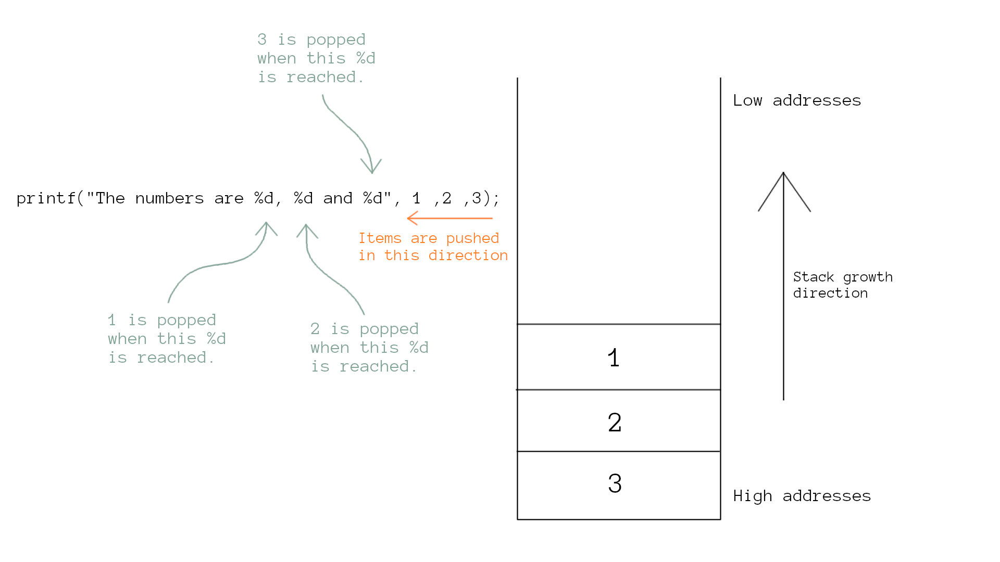
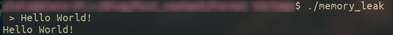
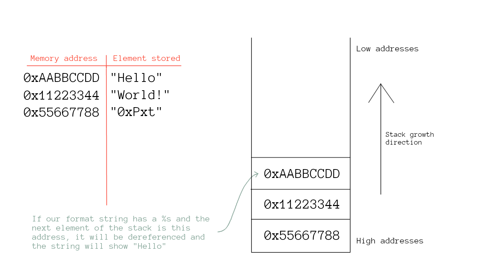
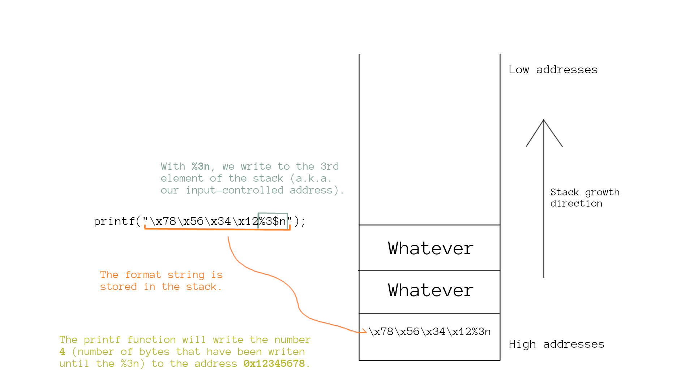

# Format String Vulnerability

## Introduction

Format strings show up very frequently in the source code of various applications. These strings are the ones that allow for various kinds of formatting with through the use of some special characters such as `%d`, `%c`, `%s`, etc.

I need to create some hype in the introduction so don’t mind me asking you the following question : 

**Did you know that there is a severe vulnerability regarding the use of this strings?**

Now I have you hooked, don’t I? 😉

In this post, we will explore a vulnerability related to format strings that allows the attacker to dump some memory from the machine and even achieve RCE (Remote Code Execution).

This article will provide a profound explanation of the vulnerability, as well as the knowledge necessary to exploit it, all along with my beautiful explanations that will puzzle out every question you can come up with.

### Prerequisites

Before trying to exploit the vulnerability, I need to make sure that every reader is familiar with format strings, and that you are aware of its ins and outs. If you already know how format strings work, feel free to skip this section and dive right into the PoCs (make sure you know what `%n` does if you decide to skip this section).

Format strings are used in common functions from different libraries, a glaringly obvious example is the `printf()` function (Many more in [here](https://devdocs.io/c/io/fprintf)). The function prototype in the C programming language is something like the following :

```c
int printf(const char *format, ...)
```

> The string constant `format` provides a description of the output, with placeholders marked by "%" escape characters to specify both the relative location and the type of output that the function should produce. The return value yields the number of printed characters.      [Wikibooks - C Programming/stdio.h/printf](https://en.wikibooks.org/wiki/C_Programming/stdio.h/printf)
> 

By now, we know that format strings allow us to substitute **conversion specifications** (colloquially known as **format specifiers**) of the form `%<conversion specifier>` for some parameter that we specify, and they allow us to format that parameter according to this chart :

| Format Specifier | Type |
| --- | --- |
| %c | Character |
| %d | Signed Integer |
| %e or %E | Scientific notation of floats |
| %f | Floating Point Values |
| %g or %G | Similar as %e or %E |
| %hi | Signed Integer (short) |
| %hu | Unsigned Integer (short) |
| %i | Unsigned Integer |
| %l or %ld or %li | Long |
| %lf | Double |
| %Lf | Long double |
| %lu | Unsigned Integer or unsigned long |
| %lli or %lld | Long long |
| %llu | Unsigned long long |
| %o | Octal representation |
| %p | Pointer (Prints an Address) |
| %s | String |
| %u | Unsigned Integer |
| %x or %X | Hexadecimal representation |
| %n | Prints nothing (But will be very useful for us) |
| %% | Prints % character |

Additionally, if we add a number after the `%`, we specify the width of the string, with a minus sign (`-`) we specify left alignment, and a period (`.`) can be used to separate the width and the precision fields.

### Format Strings on the Stack

When used in the `printf()` function, the arguments are pushed to the stack in reverse order, so that the format string remains on top.

By organizing the stack this way, once the function is called the format string will start to be read until it finds a format specifier, then **it will grab the next stack address and substitute it**, giving it the format described by the format specifier.

Let’s clarify this with a picture :



## Exploitation

This should be everything you need to understand the vulnerability and how to exploit it, so let’s get our hands dirty!

### PoC : Dumping Memory

Up until this point, we are knowledgeable that in format strings, each format specifier is replaced with the corresponding argument, but there is a clutch question that a hacker needs to ask at this exact instant :

**What if the number of arguments and the number of format specifiers do not match?**

Well, I am excited to tell you that you just found a vulnerability. What will happen is that the next address of the stack will be used as an argument.

What does this exactly mean? Let’s see an example :

```c
#include <stdio.h>

int main(int argc, char** argv) {
    char buff[50];

    //Prompt User
    printf(" > ");
    gets(buff);

    printf(buff); //Format String controlled by the user!!
    printf("\n");

    return 0;
}
```

The program works, but the programmer has assumed that the user doesn’t have bad intentions…



Nevertheless, we know that we’ve come here to play a little bit…


Yes, those are addresses stored on the stack. And there is even more…

---

🪶 With the syntax `%{n}$p`, we can select which address from the stack we want to obtain.

---
<br>


This technique can be used by an attacker to leak local variables, return addresses, and anything that is located on the stack. But there is even more…

In fact, as hackers, we are not limited to only dumping stack addresses, **we can read any memory address** by using the mechanism that follows.

There is a peculiarity with the format specifier `%s`, and that’s because it does not return an address, it instead returns the string that is pointed to by an address.



This means that we can provide an address that will be pushed to the stack, and right after that dereference it with `%s`, which will lead to reading the string that is in that address.

```c
#include <stdio.h>
int main(int argc, char** argv) {
    char pass[20] = "Super secret!";
    char buff[50];

    //Info about the password address
    printf("password is %s and it is at address %p\n", pass, pass);

    //User prompt
    printf(" > ");
    gets(buff);

    //Format String controlled by the user!!
    printf(buff);
    printf("\n");
    return 0;
}
```


### PoC : Writing to stack

Up in the table in which I showed you the different **conversion specifications** that exist, I am sure you noticed that there’s a `%n`, and in the type description it says : “Prints nothing (But will be very useful for us)”. This is the point in which I will explain why `%n` is so cool and we all instantly become cyber security experts.

It turns out that the sentence “prints nothing” is absolutely right, so what does this format specifier do? Well, it **writes to an argument**. By using `%n`, `printf()` will grab the argument that matches  the specifier and it will write to it the number of bytes that have been written up until that point.

This means that if we use :

```c
printf("12345%n", &a);
```

The value of a after this line of code will be 5.

Let’s look at the example just in case you don’t believe me...

```c
#include <stdio.h>

int main(int argc, char** argv) {
    int a = 0;

    //Notice how %n is waiting for an address (int *) argument.
    printf("12345%n",&a);
    printf("\n");

    printf("%d", a);
    printf("\n");
    return 0;
}
```


As we have just observed, we can arbitrarily write to arguments with the magic of `%n`, so what would happen if we overwrote any variable with an a strategically selected addresses?

Not so fast you little learner, there’s something to take into account here, imagine you want to write the address  `0xffffd10a`, that is `4294955274` in decimal, and unless you are a Java programmer I am sure you don’t want to use a string that occupies 2 screens (Plus the program would take an eternity to run).

Here is where I save your life by introducing a new trick. You can control the length of the string with the syntax `%Xd%n`, where `X` is the the number of white spaces you want. In case you are wondering if I am making all of this syntax up, you can go and check the [printf() manual](https://www.man7.org/linux/man-pages/man3/printf.3.html).

```c
#include <stdio.h>

int main(int argc, char** argv) {
    int a = 0;
    printf("%100d%n\n", 1, &a);
    printf("%d\n", a);
    return 0;
}
```


Outputs the following :


Furthermore, we can control to which bytes we are writing with the use of `%n` and `%hn`.

`%n` →Write to an entire word (4 bytes).

`%hn` → Write to half word (2 bytes).

---

Alternatively, we can write byte by byte by specifying the concrete addresses that we want to write to. For example, if we wanted to write the value `0x00XXYYZZ` to the address `0xffff0000`, we could write `0xZZ` to `0xffff0000`, `0xYY` to `0xffff0001`, `0xXX` to `0xffff0002`, and `0x00` to `0xffff0003`.

---
<br>

Remember how we can grab any address from the stack with the syntax `%{n}$p` ? Then what if we discovered where our user-supplied string is and we write there with `%n`?

We can write an address with our format string and then `%n` will write to that address! To do this, we only need to write to the Nth element of the stack, where `N` is the position that the format string occupies. As you might have already guessed, this is done with `%{N}$n`.



And of course I will demonstrate this to you. Let’s use a slightly modified version of the secret_password program:

```c
#include <stdio.h>
int main(int argc, char** argv) {
    int pass = 0x12345;
    char buff[32];

    //Info for user
    printf("password is %x and it is at address %p\n", pass, &pass);
    
    //Prompt user
    printf(" > ");
    fgets(buff, 30, stdin);

    printf(buff); //Format String controlled by the user!!
    
    //Info to see if we have modified the value of pass
    printf("\n");
    printf("password is %x and it is at address %p\n", pass, &pass);
    return 0;
}
```

First we need to find where our format string is being stored :

.

I use -%p- so that it is 4-Byte aligned and is easier to recognize when analyzing memory

See the `0x2d70252d` ? Well that is where our format string begins on the stack. How do I know? Because I know how to look up the ASCII table. Just kidding, python does this for you :


I use python 2 because I find the syntax more appealing.

We are know aware that our format string starts at the 7th element of the stack (first time we see the appearance of `0x2d70252d`). With this information, we can now write to the 7th element of the stack by using `%7$n`.

Our payload format string will be `\x2c\xd1\xff\xff%7$n`, which means : “write 4 bytes (the length of the address) to the 7th element of the stack”. Hence we will write 4 bytes to the address that we supplied.


And surely, as I mentioned earlier, we can control what we write by making the number of bytes written to stdout with `%{n}x`.


## Conclusion

That was such a brainf*ck, huh?

Even though this vulnerability is pretty easy to mitigate by just applying good programming practices, it is important to understand how dangerous it can be. And to be honest it is also pretty fun to learn about and exploit.

Moreover, I would like to mention that I just covered an easy example of how to overwrite a variable, but I bet you can imagine that it is completely possible to overwrite return addresses (amongst any other value), which means that the attacker can hijack the flow of the program and carry out devastating actions.

Imagine for example that someone overwrites the GOT (Global Offset Table) and makes some symbol point to an attacker-crafted injected shellcode (Yeah, say hello to RCE).

To put things in a nutshell, my point is that this is a fairly easy to avoid vulnerability when developing software, but be aware that the consequences of a bad implementation can lead to a catastrophe.

Once again, I really enjoyed writing this article and hope you have had a good time reading it. See you at the next one and thanks for reading me!

## References

- Hacking: The Art of Exploitation, 2nd Edition, Jon Erickson.
- [https://www.man7.org/linux/man-pages/man3/printf.3.html](https://www.man7.org/linux/man-pages/man3/printf.3.html)
- [https://vickieli.dev/binary exploitation/format-string-vulnerabilities/](https://vickieli.dev/binary%20exploitation/format-string-vulnerabilities/)
- [https://axcheron.github.io/exploit-101-format-strings/](https://axcheron.github.io/exploit-101-format-strings/)
- [https://codearcana.com/posts/2013/05/02/introduction-to-format-string-exploits.html](https://codearcana.com/posts/2013/05/02/introduction-to-format-string-exploits.html)
- [https://owasp.org/www-community/attacks/Format_string_attack](https://owasp.org/www-community/attacks/Format_string_attack)
