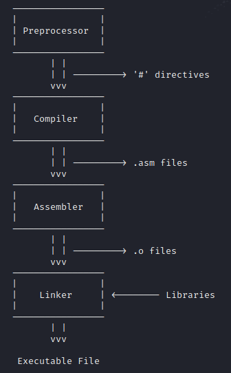

# Reverse Engineering : Bypassing Access Control

## Introduction

Well well well, reverse engineering, that sounds cool, doesn’t it? Today we will look at what this technique is all about, why it is so useful (specially in cyber security) and I’ll show a small proof of concept of how you can reverse engineer a binary to gain access to somewhere you shouldn’t be accessing. 

Reverse Engineering is the act of grabbing a binary and dissecting it in order to understand it’s behavior in very close detail. This usually is done through working one’s way through the disassembly of the executable and building up a hypothesis until the comportment of the program is fully inferred.

**Let’s get started!**

## Compiling process

Do you know what a compiler does in order to turn your program into an executable file? It essentially transforms all of your code into machine code (0s and 1s) that a computer can understand. In reality, there are some sub-steps in that process, which are preprocessing, compiling, assembling and linking. We won’t get too deep into these concepts, but I believe a basic understanding is required to understand the rest of the post.

- Preprocessor →The preprocessor decodes and executes all of the preprocessor directives that the programmer has specified in their code. Those are the ones that start with the `#` character, such as `#include` or `#define`. For example, before the compilation step, the preprocessor will include all of the files defined by `#include` instructions.
- Compilation →The compiler will translate all of the C instructions to assembly.
- Assembler → It is in charge of converting the assembly instructions into objects (.o). This files contain machine code but it is still not directly executable. But we are really close to it.
- Linker →The linker will put together all of the necessary object files, as well as the libraries in order to make our program executable.



I woke up creative today, so you’t better like such a beautiful diagram.

## Disassemblers

The aim of a disassembler is to provide understanding of a program when the source code is not available. It typically shows the assembly language instructions that a binary is composed of, and it is a complex disassembler, it will provide a bunch of information regarding the program’s code flow and different states.

Disassemblers are typically used for the following tasks :

- Analysis of malware
- Analysis of closed source software for vulnerabilities
- Analysis of closed source software for interoperability
- Analysis of compiler-generated code to validate compiler performance or correctness
- Display of program instructions while debugging

There are a bunch of disassemblers, each with its pros and cons, but arguably the most popular ones are Ghidra, IDA PRO, Binary Ninja, Radare2 and Hopper. Definitely go and check those out, and stick to the one you like the most.

## PoC : Reversing a Binary

As explained sooner, to look at the disassembly of a binary we dispose of a wide variety of options. I will use `objdump` because I think it’s the tool that adds less noise and that will provide a clear view of what we are interested in today, which is working our way through the raw disassembly. However, in more complex analysis, a powerful disassembler can safe you hours and hours of pain.

The disassembly of our binary is the following code :

```c
000011ad <main>:
    11ad:       8d 4c 24 04             lea    ecx,[esp+0x4]
    11b1:       83 e4 f0                and    esp,0xfffffff0
    11b4:       ff 71 fc                push   DWORD PTR [ecx-0x4]
    11b7:       55                      push   ebp
    11b8:       89 e5                   mov    ebp,esp
    11ba:       53                      push   ebx
    11bb:       51                      push   ecx
    11bc:       83 ec 20                sub    esp,0x20
    11bf:       e8 ec fe ff ff          call   10b0 <__x86.get_pc_thunk.bx>
    11c4:       81 c3 30 2e 00 00       add    ebx,0x2e30
    11ca:       c7 45 f4 00 00 00 00    mov    DWORD PTR [ebp-0xc],0x0
    11d1:       83 ec 0c                sub    esp,0xc
    11d4:       8d 83 14 e0 ff ff       lea    eax,[ebx-0x1fec]
    11da:       50                      push   eax
    11db:       e8 70 fe ff ff          call   1050 <puts@plt>
    11e0:       83 c4 10                add    esp,0x10
    11e3:       83 ec 08                sub    esp,0x8
    11e6:       8d 45 e4                lea    eax,[ebp-0x1c]
    11e9:       50                      push   eax
    11ea:       8d 83 39 e0 ff ff       lea    eax,[ebx-0x1fc7]
    11f0:       50                      push   eax
    11f1:       e8 6a fe ff ff          call   1060 <__isoc99_scanf@plt>
    11f6:       83 c4 10                add    esp,0x10
    11f9:       83 ec 08                sub    esp,0x8
    11fc:       8d 83 3c e0 ff ff       lea    eax,[ebx-0x1fc4]
    1202:       50                      push   eax
    1203:       8d 45 e4                lea    eax,[ebp-0x1c]
    1206:       50                      push   eax
    1207:       e8 24 fe ff ff          call   1030 <strcmp@plt>
    120c:       83 c4 10                add    esp,0x10
    120f:       85 c0                   test   eax,eax
    1211:       75 07                   jne    121a <main+0x6d>
    1213:       c7 45 f4 01 00 00 00    mov    DWORD PTR [ebp-0xc],0x1
    121a:       83 7d f4 00             cmp    DWORD PTR [ebp-0xc],0x0
    121e:       74 3d                   je     125d <main+0xb0>
    1220:       83 ec 0c                sub    esp,0xc
    1223:       8d 83 47 e0 ff ff       lea    eax,[ebx-0x1fb9]
    1229:       50                      push   eax
    122a:       e8 21 fe ff ff          call   1050 <puts@plt>
    122f:       83 c4 10                add    esp,0x10
    1232:       83 ec 0c                sub    esp,0xc
    1235:       8d 83 5f e0 ff ff       lea    eax,[ebx-0x1fa1]
    123b:       50                      push   eax
    123c:       e8 0f fe ff ff          call   1050 <puts@plt>
    1241:       83 c4 10                add    esp,0x10
    1244:       83 ec 0c                sub    esp,0xc
    1247:       8d 83 47 e0 ff ff       lea    eax,[ebx-0x1fb9]
    124d:       50                      push   eax
    124e:       e8 fd fd ff ff          call   1050 <puts@plt>
    1253:       83 c4 10                add    esp,0x10
    1256:       b8 00 00 00 00          mov    eax,0x0
    125b:       eb 3b                   jmp    1298 <main+0xeb>
    125d:       83 ec 0c                sub    esp,0xc
    1260:       8d 83 47 e0 ff ff       lea    eax,[ebx-0x1fb9]
    1266:       50                      push   eax
    1267:       e8 e4 fd ff ff          call   1050 <puts@plt>
    126c:       83 c4 10                add    esp,0x10
    126f:       83 ec 0c                sub    esp,0xc
    1272:       8d 83 77 e0 ff ff       lea    eax,[ebx-0x1f89]
    1278:       50                      push   eax
    1279:       e8 d2 fd ff ff          call   1050 <puts@plt>
    127e:       83 c4 10                add    esp,0x10
    1281:       83 ec 0c                sub    esp,0xc
    1284:       8d 83 47 e0 ff ff       lea    eax,[ebx-0x1fb9]
    128a:       50                      push   eax
    128b:       e8 c0 fd ff ff          call   1050 <puts@plt>
    1290:       83 c4 10                add    esp,0x10
    1293:       e9 39 ff ff ff          jmp    11d1 <main+0x24>
    1298:       8d 65 f8                lea    esp,[ebp-0x8]
    129b:       59                      pop    ecx
    129c:       5b                      pop    ebx
    129d:       5d                      pop    ebp
    129e:       8d 61 fc                lea    esp,[ecx-0x4]
    12a1:       c3                      ret
```

I know it seems a huge blob (the reality is that this one is pretty damn small), but let’s try to get some information.

My first tip when trying to understand what the assembly code does is to look at the `jump` and `call` instructions, they will give us some insight about the flow of the program.

There are a bunch of calls to `puts`, and those are only there to print stuff to the console.

By looking carefully, we see a call to `scanf` at `11f1` and a call to `strcmp` at address `1207` , then, a couple of addresses below that, we find a `jne` instruction at `1211`.

We don’t need to use our imagination that much to grasp that the program asks the user for some input with `scanf`, then compares that input to something and makes the decision of whether to jump somewhere or not to.

To my eyes, the question here is : how can we find the thing that the program is comparing to the user input?

There are several ways, but the easiest one is to use the `strings`  command, which will print out all of the strings that are inside the binary :


Easy, right? Obviously this is by far the easiest example that you will find, but it is good ground to settle the basics.

Just to make sure that our conclusion is right, let’s check what the Ghidra decompiler says about the executable :


We can kind of guess that there is indeed being a comparison with the “`0xDEAD2BAD`” string, but a bit of variable renaming will help us a lot with the analysis : 


Now that’s way better. It is now pretty clear that there is a flag that will control the access, this flag is always disabled if the comparison goes wrong, so we as users will need to provide the correct password to access the admin panel.

By the way, Ghidra already tells us that the comparison is carried out to compare the user input and the password, but I didn’t want to spoiler you. Here you have a snippet of the Ghidra disassembly :


Both arguments are pushed to the stack and then the `call` is made.

## Conclusion

As you have seen, reverse Engineering is a very powerful technique, which mainly helps cyber security professionals to understand the behavior of malware.

In our little example, we reversed a very simple binary and understood its behavior in a matter of minutes, but sometimes, a specialized professional is needed to go through these kind of details, specially when the executable is complex and sophisticated, and I can assure you being good a this takes a lot of time and dedication.

Once again, I hope you have enjoyed and learnt something, and I highly encourage you to do some reversing exercises in order to better understand this practice. Surely, you can expect many more posts to come regarding this topic. Thank you for reading me and have a good day!

### Resources

The Ghidra Book : The Definitive Guide, Chris Eagle and Kara Nance.

[Reverse Engineering for Begginers](https://www.beginners.re/)

[https://crackmes.one/](https://crackmes.one/)

[Wikibooks - Disassemblers and Decompilers](https://www.notion.so/Reverse-Engineering-Bypassing-Access-Control-8ebce6a349ec414cafbf7af7b48214c5)
