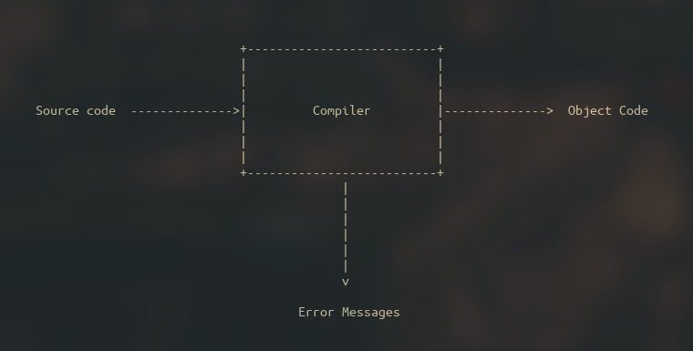

# Compilers : Lexical analysis

## Introduction

I am sure that you all know how to compile your code, and you probably also know that the function of the compiler is to transform the source code into an object file. But do you know how compilers really work? The ins and outs of a compiler are known to be an extremely hard topic, and if you ask me, also a pretty damn interesting one. Today we will have a look at the first step that a compiler goes through in order to achieve its goal, which is the **lexical analysis**.

But first things first, let’s lay down some foundation on what a compiler is, and then we can have a look at those details.

### What is a compiler?

A compiler is a program. That is the first thing you want to know, it is indeed a piece of software but with a very particular function, which is to convert source code into object code.

Let’s provide some definitions :

- Source code → It is the code that is written in a high level language, and it has some features to improve human readability, such as comments, naming, etc. It is very close to the human language and thus it eases the task of coding for us humans.
- Object code → If you can read this, you should get some light because you have not left your room in a while. Just kidding (not really), object code is the program that is written in machine code (binary) and it is [the product of a compiler](https://en.wikipedia.org/wiki/Object_code).

### What steps constitute the compilation process?

The compiler goes through six different phases, and as I mentioned today we will have a look at the first one.

### Lexical Analysis

This is the first phase of the process, and it consists of the elaboration of a series of lexical components that will be fed to the parser (second phase). The goal of lexical analysis is to partition the input string into lexemes, and to identify the token that corresponds to each lexeme (these definitions are provided in a table a couple of scrolls away, down below).

One of the parser’s missions is to retrieve these lexical components from the lexical analyzer, and it does so by calling a function (or a bunch of them) created by the lexical analyzer that provides the next token every time. What the parser will do then, is to call the function, analyze the component, and call the function again. This process will be repeated up until the point where nothing is returned by the function, which will mean that there is nothing left to analyze.

Let’s throw out some definitions before stepping forward any longer :

| Term | Description |
| --- | --- |
| Token (Lexical component) | A lexical token is a sequence of characters that can be treated as a unit in the grammar of the programming languages. A token can be viewed as a “class” for a lexeme. This means that for example, the lexeme `==` corresponds to a “relation” token. |
| Lexeme | It is the instance of a token. The lexeme is the sequence of characters from the source code with which the pattern for a token matches. Consider the patter for a “relation” token to be something like `<` or `<=` or `==` or `<>` or `>=` or `>`, then the sequence `<=` would be a lexeme that corresponds to the “relation” token. |
| Pattern | A pattern is a set of rules a scanner follows to match a lexeme in the input program to identify a valid token. It is like the lexical analyzer's description of a token to validate a lexeme. Patterns are implemented through https://en.wikipedia.org/wiki/Deterministic_finite_automaton, which consist in a state diagram. If the string reaches the end of the diagram, it is consider valid. But don’t worry about this last sentence, we will have a closer look soon.  |

To put it in simple terms, an input string (the source code) is fed to the compiler, which uses patterns to try and find matches in the code. The matches that are found are called lexemes, and these lexemes are the concrete instance of what is called a token.

We have reached the point in which things start to get really interesting. Now we know some of the fundamental concepts and we are going to combine them in order to achieve the lexical analyzer’s objective, which if you remember, is to **partition the input string into lexemes and identify the token of each lexeme.**

I introduce you to ✨transition diagrams✨ (yes, that’s a satire). These diagrams are state diagrams the purpose of which is to recognize the lexical components of a string. This diagram works through the use of a pointer, that advances along the entry buffer and categorizes the characters that are encountered.

One such diagram disposes of states (circles) and edges (arrows). Each arrow shows the input characters of a state through a label, as well as the output from which they depart. Iit is out of the scope of this publication to get into detail about how DFAs work, but it is good to know that these diagrams are what is implemented through a **D**eterministic **F**inite **A**utomaton.

Let’s have a look at an example for the pattern `>=` and `>`:

1. Its initial state is 0.
2. From state 0, we read the next input character
3. The edge labeled with `>` leads us to state 1. In case the edge is not followed, it would mean that the pattern does not match with the string provided.
4. We reach state 1 and read the next character.
5. If such character is `=` then we would reach state 2, otherwise, we should end up at state 3.
6. The states with double circle mean that the string has been accepted.

---

In the case of reaching state 3, did you notice that there is a little asterisk on its top right corner? That means the input string has been accepted, but we need to step back for once character. As you may imagine, this implies that we must “unread” the last character and accept the character `>`. Hence the just “unread” character will be a candidate for the next pattern to analyze.

---

Thanks to these transition diagrams, the different tokens forming the source code are identified, and the output is passed onto the next step, the syntactic analysis (the parser). 

## Conclusion

To put things in a nutshell, the lexical analysis is the first step encountered all along the compiling process. It is in charge of dissecting the source code and feeding lexical components to the parser.

As you may imagine, the implementation of these analyzers is by no means trivial, and there is a lot of research and effort put into creating quality compilers.

In future posts we will dive deep into some of the other compiling stages (and some are very challenging and fun to understand), I hope you like this kind of posts, in which I discuss some heavy theory. In the end, it is necessary to have a strong knowledge of the theory before jumping in some subjects, and compiler design is definitely one topic that needs some theory background.

I am glad you have read this far, and I really wish you a great day, see you!
