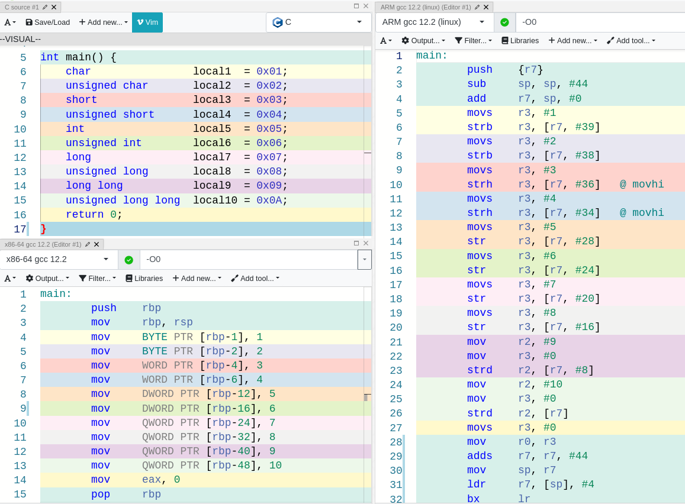

# Reverse Engineering : Data Structures

## Introduction

Greetings fellow humans! Be welcomed to yet another reverse engineering post (check [this one](https://0xpxt.github.io//Reverse-Engineering-Bypassing-Access-Control/) out if you haven’t). In today’s article we will explore with some good level of detail how data structures translate from C source code to assembly, and how to obtain the source code when all we have is a shy binary that won’t tell us anything.

The goal of this writing is to get you to know, through some theory and well-chosen examples, how compilers convert data structures to assembly code, and how we, as reverse engineers, can extract a lot of information from a simple executable.

Without further ado, let’s get this moving!

## Reversing Data Structures

As I am sure you already know (if you don’t, you may want to reconsider reading this), when programmers write code they make use of different [data structures](https://en.wikipedia.org/wiki/Data_structure) in order to store in memory different values that they need.

By understanding how this data structures work and how the compilers uses them, we can deduce the programmer’s intention, and retrieve some really valuable information!

You need to keep in mind though, that throughout the compilation process, there is a loss of some of the information that was present in the source code, such as comments or some implementation that the compiler has decided to optimize.

### Variables

Variables are the most basic data structure of them all. What is really interesting for us here, is that there are some factors that will decide how variables are implemented, such as **size, scope or storage.**

The size of a variable and the architecture for which the program is compiled can make a huge difference in the final product.

Here are the sizes that a variable can have in a 32-bit architecture :

| Type | #bits | Min. value | Max. value |
| --- | --- | --- | --- |
| signed char | 8 | -127 | 127 |
| unsigned char | 8 | 0 | 255 |
| short | 16 | -32768 | 32767 |
| unsigned short | 16 | 0 | 65535 |
| int | 32 | -2147483648 | 2147483647 |
| unsigned int | 32 | 0 | 4294967295 |
| long | 32 | -2147483648 | 2147483647 |
| unsigned long | 32 | 0 | 4294967295 |
| long long | 64 | -(2^63) | (2^63) - 1 |
| unsigned long long | 64 | 0 | (2^64) - 1 |

For 64-bit architectures, there are several options, which can be summarized in the following table :

| Type | LP64 | ILP64 | LLP64 |
| --- | --- | --- | --- |
| char | 8 | 8 | 8 |
| short | 16 | 16 | 16 |
| _int32 | x | 32 | x |
| int | 32 | 64 | 32 |
| long | 64 | 64 | 32 |
| long long | x | x | 64 |
| pointer | 64 | 64 | 64 |

If you are really nerdy and want some more information you can read [this paper](https://unix.org/version2/whatsnew/lp64_wp.html) (it is pretty easy and fast to read).

Now that we know the sizes that any variables can have, let’s get our hands dirty. For the examples that I will be showing I am going to use a tool called [Compiler Explorer](https://godbolt.org/), which I consider to be one of the best tools to use if you are getting started in Reverse Engineering.

In the following picture, we can observe the disassembly for two different architectures: 

intel 32/x86 (bottom left one) and ARM (right one).

To see how the sizes change in the **intel assembly**, we need to look closely and find the qualifiers `BYTE`, `WORD`, `DWORD` and `QWORD`. A `WORD` is equivalent to 2 bytes (16 bits), a `DWORD` to 4 bytes (32 bits) and a `QWORD` to 8 bytes (64 bits).

In **ARM**, things are a little bit different, and you can see that in order to access memory we always need to perform [load and store operations](https://azeria-labs.com/memory-instructions-load-and-store-part-4/). 

The suffix (last character) in the instructions shows us the size that the instruction wants to deal with. For instance, the `strb` instructions will store a byte, `strh` will store 2 bytes, `str` stores 4 bytes and `strd` stores 8 bytes.

To finish this variables’ section, I’d like to walk you through the other two factors that can be modified in a variable, which are scope and storage.

- Scope → It dictates the locations of a program from where a variable can be accessed.
- Storage Classes → The keywords `auto`, `static`, `extern` and `register`.

Local variables are placed on the stack when a program is running, and globals are either placed on the `.bss` section if they are not initialized, or in the `.data` section when they are.

As the picture shows, when we try to perform any operation on local variables, we find them in reference to the base pointer or the stack pointer (`rbp` and `rsp` for intel and `r11` and `sp` for ARM). However, when a global variables needs to be accessed, the assembly code finds it under the label `global1`, which represents a section in memory somewhere, out of the stack.

### Arrays

When using arrays, **each element of the array is contiguous to the previous one** in memory.

A rudimentary representation of this would be :

When reversing, they are fairly easy to identify, since we will see how memory positions that are one next to each other are accessed. Moreover, arrays always contain elements of the same data type, so that is also something to keep in mind when trying to find one.

I believe the following example will illustrate my point clearly :

In this example it is glaringly obvious that each element of the array is placed next to each other in memory. Remember that each `int` occupies 4 bytes and each `char` 1 byte. Each position is accessed through the `rbp` (the example corresponds to an intel architecture) and an offset, and by looking at the offsets, we see that each element in the integer array is separated by the size of an `int`. And how not, the same happens for the char array, but since two characters are placed at once in a single instruction, the memory addresses used are `rbp - 35` and `rbp - 33`.

The number `25928` is `0x6548` in hex, which if you look up in the ASCII table, you will find it encodes the characters ‘e’ (`0x65`) and ‘H’ (`0x48`). And finally, as you have already guessed, the number `121` in decimal is the same as `0x79`, which corresponds to the character ‘y’.

### Pointers

Pointers are containers for addresses. Each variable declared as a pointer points to a certain data type, but all a pointer does is hold an address and allow the programmer to dereference such address. Depending on the arch, a pointer will be 32-bit or 64-bit.

There’s not much more that I want to explain about pointers , since I don’t want to make this post a first year Computer Science class, so let’s use Compiler Explorer to play around a little bit.

Pretty interesting, huh? If you can’t figure it all out don’t worry, hold my hand and walk with me through the wonderful world of pointers…

In order to understand this example, let’s focus on the intel architecture, and I will leave the ARM snippet for you to figure out.

Line 4 doesn’t do anything weird, it just grabs the number 1 and places it on the stack, accessing the memory position as we have seen several times by now (base pointer and offset).

What happens in lines 5 and 6 is **we are putting a memory address inside a variable**, that’s our pointer! `lea` loads the address of `a` to `rax`, and then `mov` puts that address into the local variable `p_a`, which is the pointer.

As you can see in line 7, incrementing a pointer means incrementing the address, not the value that the pointer is pointing to. Also a cool thing to notice is that the address is incremented by 4, not by one. This is due to the pointer holding an `int` address, if it were a pointer to a `char`, it would be incremented by 1.

Finally, we get to the beefy part, dereferencing a pointer and incrementing the value it points to. The address held by the pointer is moved to `rax` in line 8, and then the value pointed by that address is put into `eax` in line 9. Line 10 loads the address of the value (not the address of the pointer) + 1 to `edx`. Finally, `rbp - 8`, which corresponds to `p_a` is moved to `rax`, and the address of the incremented value (which is currently in `edx`) is put into `rax` (aka `p_a`). In conclusion, the pointer is dereferenced, the value incremented, and then the address of the incremented value is stored in the pointer. 

### Structures

Assembly language doesn’t know what a structure is, and it treats the fields of a structure just like any other variable.

There is a clue, however, that can **reveal the existence of a structure in the source code**, and that is **when a function is passed a pointer to a structure as an argument**. When this happens, the compiler will store a pointer to the base of the structure in a register, and then the variables in the structure will be accessed through that register plus an offset.

This is what I am talking about :

When you recognize this pattern with ease, it is trivial to come to the conclusion that there is a struct in the source code. 

### Conclusion

To properly reverse a binary, it is of utmost importance that you understand data structures and how the compilers treats them. Once you do, reversing object code and converting it into source code is much easier, since you get a full picture of the variables, arrays, structs, etc. that are being used in the source code.

To finish this post, I would like to highlight the importance of familiarizing yourself with seeing direct translations from C to assembly, since being exposed to this translations is what makes your brain do better at pattern recognition, which is truly significant in reverse engineering. Since there are amazing tools such as Compiler Explorer, in which you can just open your browser and start playing around, why not give it a try right now?

I genuinely wish you have learnt something by reading this article, and I can’t recommend yo enough that you not only read what I write, but also try it with your own hands. Thank you all once again for reading me, have a great time. See you on the next post!
