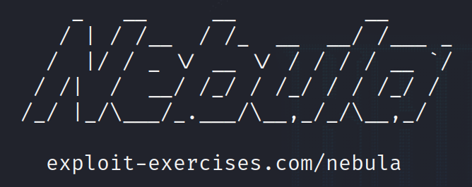

# Nebula 07-10



## Introduction

Hello there! Today’s post will be a quick one, we will go over the **Nebula** exercices (07,08,09 and 10) from [exploit education](http://exploit.education/) (as promised in [this post](https://0xpxt.github.io//Nebula0006/)). I don’t intend for this article to be only a walkthrough, I really want you to understand the concepts that I will show, and that’s why I highly recommend you to do the exercises before reading this.

Given the courtesy disclaimer, let’s start!

## Level07

This exercise requires us to find a vulnerability in the following code :

```c
#!/usr/bin/perl

use CGI qw{param};

print "Content-type: text/html\n\n";

sub ping {
  $host = $_[0];

  print("<html><head><title>Ping results</title></head><body><pre>");

  @output = `ping -c 3 $host 2>&1`;
  foreach $line (@output) { print "$line"; }

  print("</pre></body></html>");
  
}

# check if Host set. if not, display normal page, etc

ping(param("Host"));
```

The code is supposed to ping the host that is passed as a parameter, so let’s see what we find out…


Among the files that we are given, we find a `thttpd` configuration file, from which we can obtain that the port the service is running on is the 7007. Who the f*ck runs a service on 7007? Whatever, let’s move on.


It now seems logical to me to try and find out what this service is doing, right? Typing in the URL with the port 7007 gives us the instructions for the usage of the service :


Just to check that the script works properly, let’s provide it with a host like `www.kali.org`.


Looking good! The host is pinged 3 times just like specified in the line `@output = `ping -c 3 $host 2>&1`;` of the source code. However, there's clearly a command injection vulnerability in here. Can we inject our `getflag` command by passing in the parameter `Host=;getflag`?


**Nope!** But why? Well, URLs do need a special encoding for some characters, and `;` is one of them. By looking up the conversion on any URL encoder, we can find what we want and see how the command is now properly injected :


As you can see,  `;` is encoded as `%3B` for an URL. I used the site [urlencoder.io](https://www.urlencoder.io/) in case you want to repeat my steps, but again, any URL encoder will do. 

## Level08

For level08 we are not given any source code, but by listing the files in the flag directory we can see some stuff. There is a `.pcap` file which is world-readable, it won’t hurt anybody to take a quick peek...


Since we are on a remote machine connected through ssh, I want to send the file to my local machine, so that I can analyze it with Wireshark.

There are multiple ways of sending the file, but I chose scp because it was as easy as running the following line : `scp <fileToCopy> capture.pcap <my_user>@<my_@IP>:<destinationPath>`

Since scp runs through ssh, you need to make the ssh available on the local machine, which is done by using `systemctl start ssh`. If you want to check the ssh status, you can run `sudo service ssh status`.

Here are some pics showing what I mean :


SSH disabled


Send file over scp


File received

Once the `.pcap` file is under my control, I can open it up with Wireshak, which allows to find the password by [following the TCP stream](https://www.wireshark.org/docs/wsug_html_chunked/ChAdvFollowStreamSection.html).


But wait a second, those dots are non-printable characters, thus they need to be looked into with more detail :


The hex number `0x7F` represents a `[DEL]` in the ASCII table, so the final password is backd00Rmate.

I am sure you get why, but just to clarify, the user pressed [DELETE] while entering the password and those keystrokes were sent over the TCP connection, so the final result is composed of :

- backdoor[del][del][del] →backd
- 00Rm8[del] →00Rm
- ate[CR] →ate<ENTER>

Which if we put together, is **backd00Rmate**.


## level09

The source code for this level is :

```c
<?php

function spam($email)
{
  $email = preg_replace("/\./", " dot ", $email);
  $email = preg_replace("/@/", " AT ", $email);
  
  return $email;
}

function markup($filename, $use_me)
{
  $contents = file_get_contents($filename);

  $contents = preg_replace("/(\[email (.*)\])/e", "spam(\"\\2\")", $contents);
  $contents = preg_replace("/\[/", "<", $contents);
  $contents = preg_replace("/\]/", ">", $contents);

  return $contents;
}

$output = markup($argv[1], $argv[2]);

print $output;

?>
```

Found any vulnerability yet? I highly recommend you read [this stack overflow post](https://stackoverflow.com/questions/16986331/can-someone-explain-the-e-regex-modifier).

I couldn’t find a lot of information online, since the `/e` modifier is a deprecated PHP feature, which seems to allow for command execution. 

Therefore, what the script will do is to execute the `spam()` function on the second regex match (the `(.*)` expression).

Since we can’t inject anything in the `markup()` function or in main (all they do is print stuff), what about injecting code in the call to `spam()`? We know that the code we put there will be executed, so why not give it a shot?

I have to warn you, though, that there is a little bit of a trick in this exercises regarding the PHP syntax.

Hence I will try to explain [simple](https://www.php.net/manual/en/language.types.string.php#language.types.string.parsing.simple) and [complex](https://www.php.net/manual/en/language.types.string.php#language.types.string.parsing.complex) syntax as quick as possible.

- Simple syntax →Dollar sign ($) before name.
- Complex syntax →Dollar sign and curly braces surrounding name.

That was quick, wasn’t it?.

In order for the code to execute our command, we need to use complex syntax, and escape the command with backticks (```).


Yep, there’s not much more to it. I didn’t love this challenge because it is kind of brute forcing your way through it with the syntax, but anyway, there you have the solution. What you should take home from the exercise is that if you find a `/e` and a regex in PHP, you need to instantly think about command injection.

## Level10

Finally, the last exercise for today. I hope I’m not boring you too much.

The code that we are given in level10 looks like this :

```c
#include <stdlib.h>
#include <unistd.h>
#include <sys/types.h>
#include <stdio.h>
#include <fcntl.h>
#include <errno.h>
#include <sys/socket.h>
#include <netinet/in.h>
#include <string.h>

int main(int argc, char **argv)
{
  char *file;
  char *host;

  if(argc < 3) {
      printf("%s file host\n\tsends file to host if you have access to it\n", argv[0]);
      exit(1);
  }

  file = argv[1];
  host = argv[2];

  if(access(argv[1], R_OK) == 0) {
      int fd;
      int ffd;
      int rc;
      struct sockaddr_in sin;
      char buffer[4096];

      printf("Connecting to %s:18211 .. ", host); fflush(stdout);

      fd = socket(AF_INET, SOCK_STREAM, 0);

      memset(&sin, 0, sizeof(struct sockaddr_in));
      sin.sin_family = AF_INET;
      sin.sin_addr.s_addr = inet_addr(host);
      sin.sin_port = htons(18211);

      if(connect(fd, (void *)&sin, sizeof(struct sockaddr_in)) == -1) {
          printf("Unable to connect to host %s\n", host);
          exit(EXIT_FAILURE);
      }

#define HITHERE ".oO Oo.\n"
      if(write(fd, HITHERE, strlen(HITHERE)) == -1) {
          printf("Unable to write banner to host %s\n", host);
          exit(EXIT_FAILURE);
      }
#undef HITHERE

      printf("Connected!\nSending file .. "); fflush(stdout);

      ffd = open(file, O_RDONLY);
      if(ffd == -1) {
          printf("Damn. Unable to open file\n");
          exit(EXIT_FAILURE);
      }

      rc = read(ffd, buffer, sizeof(buffer));
      if(rc == -1) {
          printf("Unable to read from file: %s\n", strerror(errno));
          exit(EXIT_FAILURE);
      }

      write(fd, buffer, rc);

      printf("wrote file!\n");

  } else {
      printf("You don't have access to %s\n", file);
  }
}
```

Don’t worry, I will provide you with some links to guide you in case you haven’t been able to crack this challenge.

First off, you can have a look at the `access` [manual](https://www.man7.org/linux/man-pages/man2/access.2.html), and then, if you still don’t see how we can exploit the vulnerability that exists in this code, I leave you with something to read about the kind of vulnerability that we are facing : [TOC/TOU](https://en.wikipedia.org/wiki/Time-of-check_to_time-of-use).

After reading the Wikipedia post, you should understand the vulnerability, but I will explain it anyways to boost my ego.

Do you see how the `open()` function is called after `access()`? What if the file that is being used has its contents changed? That’s right, something can be messed up in this situation.

The [access manual](https://www.man7.org/linux/man-pages/man2/access.2.html) tells us the following : 

> 
The check is done using the calling process's real UID and GID,
       rather than the effective IDs as is done when actually attempting
       an operation (e.g.,open(2)) on the file.  Similarly, for the
       root user, the check uses the set of permitted capabilities
       rather than the set of effective capabilities; and for non-root
       users, the check uses an empty set of capabilities.
       This allows set-user-ID programs and capability-endowed programs
       to easily determine the invoking user's authority.  In other
       words,access() does not answer the "can I read/write/execute
       this file?" question.  It answers a slightly different question:
       "(assuming I'm a setuid binary) can the user who invoked me
       read/write/execute this file?", which gives set-user-ID programs
       the possibility to prevent malicious users from causing them to
       read files which users shouldn't be able to read.
> 

TLDR; `access` does the check properly with the caller’s real UID (level10), but the `open` operation uses the effective UID (flag10).

SInce the SUID bit is set for the binary `flag10`, if we called `open()` on it, we would have our permission granted.

Armed with this knowledge, how do we exploit the TOC/TOU vulnerability in order to create a race condition that allows us to change the file we are working with before opening it and after checking its privileges?

Let’s just do it the obvious way and see what happens :


Alright! That was easy… By creating a symbolic link to a file that we own and constantly changing the link to point to either the real token or our crafted file, we can find an execution in which the link update will be carried out between the file check and the file opening. In my case, it took 2 executions, but it really is random if we use this technique.

And that is the way I believe the challenge is intended to be passed, but I need to tell you I found another way, which is unbelievably easier.

In our home directory, there is a file called `x` , if we run the `strings` command on it, we directly find our token.


## Conclusion

There’s not much more to say for this post, apart from encouraging you to try this exercises yourself (you should have done them before reading this 😡).

For sure in case you have any questions feel free to contact me and I will respond as soon as I can.

Thank you for reading me and have a great day!
