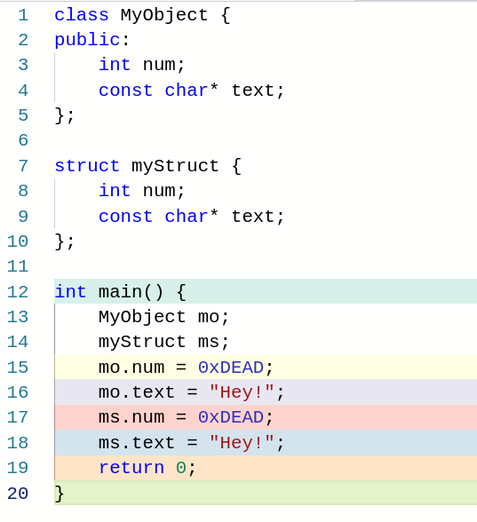

## Introduction

Greetings fellow readers! (I don’t even know how much people read this because I do not track the stats). Today we will be seeing some assembly code regarding the use of objects in C++. And what is more, we will learn how to grasp if there is an object in the source code just by looking at the disassembly.

Firstly, I will show you the differences and similarities that exist in the object code when we are dealing with structures and objects, and then we will talk about an object’s constructor as a way of unmistakably detecting the existence of an object.

Sounds cool right? **Let’s get this moving!**

## Object vs struct

In the following snippet of code, we do something pretty basic, which will generate a small bunch of assembly instructions that I am sure will show you how objects and structs relate to each other.

We create a new class and a struct, and then we access some fields of both those structures, let’s see how the compiler translates the source code :

When we look at the assembly, it is exactly identical for an object than for a struct. Let’s first check out the object code for intel and then we will move to ARM.

x86/32 :

Lines 7 and 8 take care of the object, notice how lines 9 and 10 are exactly the same but instead they are executing operations that are related to the struct.

In order to assign the number `0xDEAD` to the `num` attribute of `MyObject`, the compiler treats `mo.num` as a local variable (accessed through `ebp - offset`).

As you can see, the behavior is the same for the struct, the only thing that changes is the position the variables are stored in the stack (obviously), but that gives us no information at all about whether we are dealing with a struct or with an object.

And there is more! Remember what I explained in [this post](https://0xpxt.github.io//Reverse-Engineering-Data-Structures/)’s structures section?

We seem to be in trouble here, since the assembly code for structures, objects and local variables is identical.

(Here’s the snippet I am referring to, just in case you are too lazy to check the awesome post I just linked)

Well, let’s first check what happens in ARM and then we will get onto how to detect the use of objects in source code through the disassembly.

ARM 32 bits:

See anything different? If you said yes, you are not understanding anything… In this snippet we see the exact same behavior but with the ARM ISA (Instruction Set Architecture). 

Remember that in an ARM processor, operating directly on memory is not allowed, and thus we need to load a value in a register (or multiple ones), perform whatever operation we desire, and then store the value in the memory location we want.

The number `0xDEAD` is assigned to the `num` attribute of `MyObject` in line 7. This value has been previously loaded in `r2` at lines 5 and 6 through a bitwise OR between 173 (`0xAD`) and 56832 (`0xDE00`) , and the same happens for the `num` field of `myStruct` in line 12.

As far as the `“Hey!”` string regards, I think it is fairly easy to see that it is stored somewhere in memory (compiler explorer uses the label `.L.str` to improve readability but you will see a different region if you compile this locally on your machine) and it is stored in the local variables in lines 11 (for the object) and 13 (for the struct) of the ARM assembly code.

## Use of the <em>this</em> pointer

As I promised, I will now explain one of the techniques that we can utilize in order to find out if we are dealing with an object. I am sure you are well aware of how the <em>this</em> pointer is used inside an object’s function to access the object’s attributes or methods, but do you know how that use is translated to assembly code? 

To my eyes, there is such a cool thing that happens : <u>The compiler implicitly passes an argument to the function, without the programmer telling it to do so.</u>

Anytime you see that an argument is passed to a function (we are dealing with 32 bit architectures so the arguments are passed on the stack) and then that argument is used as the pointer from where to reference other variables or functions, you are **probably (we’ll see why)** dealing with an object.

Let’s check out the code!

x86/32 :

Do you see that in line 16 of the object code? `eax` is pushed to the stack and it contains the value stored in `ebp - 8`, which if you look closely, you will find out it is the base of the object `mo`. We know this because in line 13, `mo.num` is assigned the value 57005, and `mo.num` is the first variable of the object, thus a pointer to it is a pointer to the base of the object.

The function is empty in this snippet, so you can’t see how other variables are accessed, but since I am feeling generous today, I will type that for you :

In here we can observe how the `a` variable is accessed through the base pointer and the `num` attribute of `MyObject` is accessed through `ebp + 8`, which is something outside the current function’s stack frame. Do you know what that is? 

I will straight up tell you the answer, it is the `mo` variable that we pushed to the stack just a minute ago (maybe a couple minutes if you are a slow reader)!

I hope it is clear by now how the compiler implicitly passes in a pointer to the object that it is dealing with in an intel processor, but what about ARM?

ARM 32 bits :

You got a little scared before seeing the picture, didn’t you? Yes, the behavior is exactly the same for ARM, but where is the fun if I don’t try to make you excited?

As you can see once again, when branching into `foo()` in line 23, the `sub` instruction substracts `0x12` from `r11` and puts the result in `r0`, and then uses that in the label whose name I won’t even try to type. 

In ARM, `r11` is the **base pointer**, so what is happening in here is that we are storing in `r0` the address of the pointer to `mo` (and you can verify this by looking at line 16, which shows how `r11 - 0x12` is where `mo.num` is located).

Once arrived at this point, I have to admit that there is something that I have been hiding from you. <u>This is not a trustworthy method to detect if we are dealing with an object.</u> It would be reliable if we had the source code available, but the truth is we probably won’t in real life.

The method is flawed because it assumes that the function that is called is not expecting any argument, but what if that argument is a struct?

When a struct is passed in by reference as an argument, its variables are also accessed relative to an address that points to the base of the struct (as we saw [here](https://0xpxt.github.io//Reverse-Engineering-Data-Structures/)). Therefore, there is no reliable way of applying this method if the source is not given to us.

We will know that we are dealing with a struct or an object and not with independent variables, but we can’t affirm the presence of an object. 

Just to make sure you understand this last part, look at the following image :

I have removed some code in order to make this fit in one visible screenshot, but do you see what I am talking about? A reference to a struct is passed in as an argument (`eax` is pushed to the stack just like we saw when calling the function with no arguments). 

The issue here is that only by looking at the object code we have no way of knowing if this was done by the programmer or implicitly done by the compiler.

## Truly revealing an object, constructors

You caught me, I have been keeping the best part for now. An undeniable indicator of the use of an object in the source code is seeing a call to the object’s constructor in the assembly code.

This picture shows the disassembly of the main function in x86/32 :

And this one the disassembly of the constructor :

By now you may be wondering how on Earth do we know where the call to the constructor happens and how do we know that function is the constructor, and I’ll give you that, it easy somewhat tricky to spot.

By using the keyword `new`, <u>the compiler reserves some memory and returns a pointer (in `eax`) to that reserved memory.</u>

If you look at line 24, that is the use of `new`. How do I know that? Because in line 26 `eax` is moved to `ebx`, and then `ebx` is pushed to the stack in line 28. This means that right before the call in line 29, we have the pointer to the block of memory allocated by `new` on top of the stack.

If we now look at the asm in the function _ZN8My…(Whatever), we see how we are storing stuff in `ebp + 8` (which after having pushed `ecx` and `ebp` to the stack in lines 20 and 4, is the pointer to the block of memory that I am talking about). 

Hence it is crystal clear that **when this function is called, it is putting values in the block of memory that the call in line 24 (the call to** `new`**) gave us**. With this information, we can infer that there is an object in the source code, and additionally, we know its constructor sets its attributes to `0x10` and `“AAAABBBB”`.

Moreover, we know the object has an attribute that is an `int` because of the `DWORD PTR` in line 7, and the other attribute is a `char` array (because it stores the pointer to the beginning of `“AAAABBBB”` in line 9).

## Conclusion

To put it all in a nutshell, detecting the apparition of an object in source code by just looking at the disassembly is a possible thing to do, however, it can sometimes be a little bit tricky and we need to really understand what the compiler does and pay close attention to the details.

I haven’t talked about <em>vtables</em> in this post, which is another way of detecting objects but it is a method that’s a little more advanced and the post has gotten long enough, but don’t worry, I will explain them in the future. 

You can always do the research yourselves though (But I know it is cooler to read me explaining it 😉)!

Thank you all for having reached the end of today’s article, I hope you all have a good day and remember, do not hesitate to contact me in case you have any doubt!
