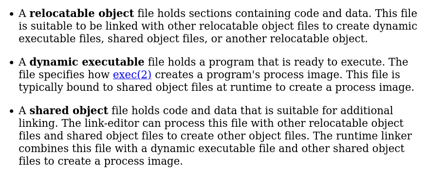

# Demystifying ELF Binaries

## Introduction

Do you think an ELF is a little creature with magical powers? Oh dear, please stay in here so that your friends stop laughing at you. 

My intention for today is to show that binary files do not contain any magic and that you can know what is that you are seeing when you run `file ./executable` (I know you think ELF is just a format for executables).

This post will have quite some theory, so I suggest you grab your favorite beverage and bear with me for a while, because I promise you will not be disappointed!

## Prerequisites

Before diving into some of the more advanced concepts, I need to make sure we are all on the same page, thus I will explain some things that I find necessary in order for you to take the maximum value out of this post.

- **Libraries** →They consist of object code, which was previously source code and has been compiled. The peculiarity with libraries is that <u>they export functions so that other binary modules can use them</u>.
- **Dynamic linker** →It is the part of an OS that is in charge of loading and linking libraries. Among its responsibilities, there is creating a binary executable and specifying which functions it imports. Furthermore, the dynamic linker is who looks for functions that are outside of a module (specified as imported functions), and it loads them and hands the control to them when needed.
- **Application Binary Interface (ABI)** →Yes, not API but ABI. <u>This interface describes the low level interface between affects two binary modules</u>, it defines how machine code has to access routines or data structures. ABIs are essential for executing the same code on different hardware.

Oh god, is it going to be like this during the whole post? **NO! I got you covered**, don’t leave yet, from here on you will have some colorful pictures to ensure you stay sharp.

## The ELF Format

We’ll first have a look at what this format is for, and then we can start seeing how it works.

> The Executable and Linkable Format is a common standard file format for executable files, object code, shared libraries and core dumps. - [Wikipedia](https://en.wikipedia.org/wiki/Executable_and_Linkable_Format)
> 

Wikipedia is wiser than me, so I highly encourage you to play around on that link for a couple of minutes, and see what you can learn.

According to Oracle’d documentation, 3 different types of object file exist :



It kind of gets boring to read these kinds of documents, so here is my (shorter) explanation :

- **Relocatable Object** → Contains code and data, in order to be useful it must be linked with something else. By being linked with something, another object of these 3 types appears.
- **Dynamic Executable** → Can be executed. It describes how the dynamic linker needs to map the image in memory.
- **Shared Object** → Contains code and data. The linker can combine these with a dynamic executable to create a an image of the process in memory.

These are <u>the 3 types of object that the ELF format can represent</u>, so keep that in mind.

It is also important to know that an ELF binary can be formed of segments or sections, depending on the point of view. **During linking, we will talk about sections, and during runtime (execution) there will be segments.** It is a must to know that segments are no other than a collection of sections.

Let’s analyze an ELF binary so that you can see what I am talking about (Here comes the fun).

### ELF Header

The ELF header is the first thing that you will find in an ELF file, and it contains (amidst many other things) **information about the segments and sections**.

Here is the structure with which the ELF header is represented, you can get this information from `man elf` :


By reading what every field means, we can see that the information related to sections and segments is stored in `e_shoff` and `e_phoff` respectively.

- shoff → section header table file offset.
- phoff → program header table file offset.


The program that we will analyze is the following :

```c
int main() {
    int a = 0xAA;
    printf("%d\n", a);
    return 0;
}

//Compiled with gcc source.c -o compiled -m32
```

`readelf` is a command line tool that will help us a lot with the analysis, with `-h` we can tell it to only display the ELF header information.


As the ELF header tells us, the segments header table is located at `base + 52`, and the sections header table is at position `base + 14352`.

If we take a look at the hexdump of the file, we can see how `readelf` is only <u>interpreting the binary</u>.


`0x34` is `52` in decimal (start of program headers, and right next to it there is `0x10 0x38`, but since this is compiled for a x86/32 architecture, we know it is stored in little endian, therefore the hex value is `0x3810`, which is `14352` in decimal (start of section headers). 

As you could have already imagined, **there is no magic involved at all**, just a bunch of bytes properly organized.

### Sections and segments

Segments are represented by the following structure :


Which we can pull from our binary once again with `readelf`. 

`readelf -l` let’s us take a look at the segments of the binary.


Also, below this information we can see the sections that are contained within the segments.


The information that is provided through these descriptions is related to **memory positions, sizes and memory alignments** (you can always read more about it in `man elf` but that is beyond the scope of this article).

By analyzing the contents of each segment, we can get some more information, and remember that <u>we only talk about segments at runtime</u>.

To carry out such analysis, you would need to dump the contents of the binary for the position that a segment is placed in.

For example, if you’d like to see what’s in the segment of type `INTERP`, you would need to scan for the next `0x180` (384 in decimal) bytes starting from position `base + <offset>`, which in this particular case would be `base + 0x1B4` (436 in decimal).


And that is pretty much all there is to know about segments, let’s move on to sections!

**Sections contain relevant information for linking and relocation**. As you may remember from the ELF header picture, the binary has 31 section headers, which are described with the `Elf32_Shdr` struct :


And how not, with `readelf -S` we can ease the information gathering :


Just as a curiosity, `sh_name` points to a table called `.shstrtab`, which contains the name of every section in the binary.

We can inspect this with `hexdump` since we know we can scan the offset `0x36F5` (14069) and size `0x118` (280) :


This has been quite a bit of information, so I won’t extend this a lot more, but before finishing I would like to show you another cool thing. The `.text` section is the section that contains the assembly code, so if we check its contents, we will see the opcodes and operands in hex, which tell the processor what to do.

Just in case you were wondering, <u>this is how disassemblers are made, but they incorporate a layer of translation through which they convert an opcode to its assembly language mnemonic, and that makes it a lot easier to read</u>.

Here’s the `.text` section’s hexdump :


And the disassembly of the `main` function :


## Conclusion

This has been everything for today guys, I hope you have enjoyed the post and learnt a lot! If I had to highlight anything from this post, it would be that **the ELF format doesn’t only regard executable binaries**, instead its scope is a bit wider and understanding its ins and outs makes you realize how cleverly designed it is.

I have tried to shed some light on you readers but there is obviously a lot more to read and learn about this format, so I would love to see you pop up a command line and mess with `readelf` and `hexdump` a little bit, and see what you find out.

See you next week!
