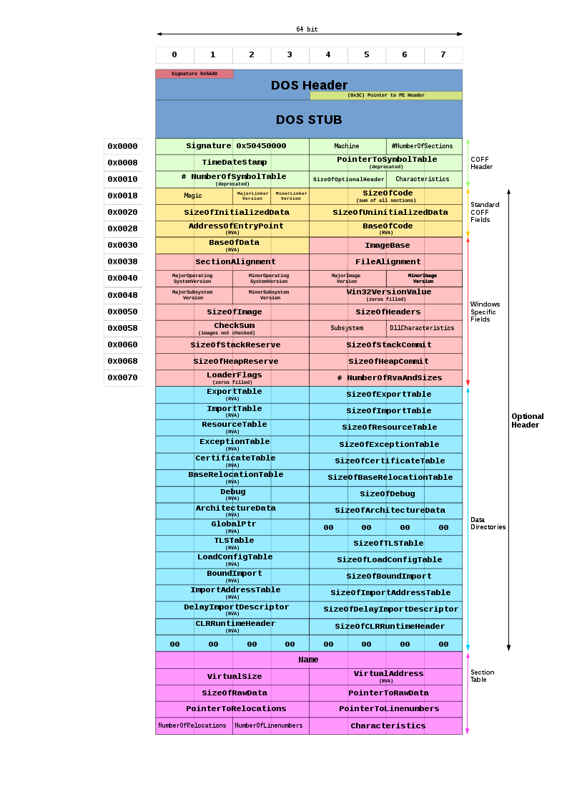

# The Portable Executable Format (PE)
## Introduction

Is there any other way of continuing the posting with a topic that’s not this one? After understanding how the Executable and Linkable Format works (you read about that in [here](https://0xpxt.github.io//Demystifying-ELF-Binaries/)), I understand you are eager for more, and not happy with only understanding Unix systems. That is why today we will cover the Portable Executable format, which (spoiler incoming) is the analogous to ELF for Windows systems.

In this post I will go through an Overview of what the PE file is, what it is used for, and how it works.

There is obviously much more to cover than what can fit in the scope of a 10-minute post, so I will leave you a couple of links at the end for you to do your own research, but don’t worry, you will be able to conduct such research with ease after finishing this read.

One last important thing before the fun, just in case you happen to be on a Unix machine and want to follow along with this guide, you can download a Windows 10 Image for research purposes from [here](https://www.microsoft.com/en-us/evalcenter/download-windows-10-enterprise). It’s official and legal, so you don’t have to worry about me trying to install a keylogger on your system.

The other option you have is to compile the source code with a cross-compiler, I will be using MinGW, which can be installed with :

```c
sudo apt-get install mingw-w64
```

## The PE format

Let’s start with the Wikipedia definition, which I think is pretty solid :

> The **Portable Executable** (**PE** format is a file format for executables, object code, DLLs and others used in 32-bit and 64-bit versions of Windows operating systems. The PE format is a data structure that encapsulates the information necessary for the Windows OS loader to manage the wrapped executable code.
> 

That is pretty understandable, the PE format is in charge of telling the dynamic linker how the binary must be mapped onto memory to create the image of a process. As you might already know, it is exclusive of Windows systems, and just as some extra information, it is fundamental to understand this format if you want to do any kind of malware reversing, game hacking, etc.

Let’s have a look at its structure (sorry for the monster image but I think it is exceptional) :



To analyze the PE format, the tool **PE File** is the go to, you can install it with :

```c
sudo apt-get install python-pefile     //Debian based distros
sudo pip install pefile                //Python Repos
```

### DOS Header

The first thing that you will encounter is the DOS header, which is represented with the `IMAGE_DOS_HEADER` structure :

```c
typedef struct _IMAGE_DOS_HEADER {
    WORD   e_magic;               // Magic number
    WORD   e_cblp;                // Bytes on last page of file
    WORD   e_cp;                  // Pages in file
    WORD   e_crlc;                // Relocations
    WORD   e_cparhdr;             // Size of header in paragraphs
    WORD   e_minalloc;            // Minimum extra paragraphs needed
    WORD   e_maxalloc;            // Maximum extra paragraphs needed
    WORD   e_ss;                  // Initial (relative) SS value
    WORD   e_sp;                  // Initial SP value
    WORD   e_csum;                // Checksum
    WORD   e_ip;                  // Initial IP value
    WORD   e_cs;                  // Initial (relative) CS value
    WORD   e_lfarlc;              // File address of relocation table
    WORD   e_ovno;                // Overlay number
    WORD   e_res[4];              // Reserved words
    WORD   e_oemid;               // OEM identifier (for e_oeminfo)
    WORD   e_oeminfo;             // OEM information; e_oemid specific
    WORD   e_res2[10];            // Reserved words
    LONG   e_lfanew;              // File address of new exe header
} IMAGE_DOS_HEADER, *PIMAGE_DOS_HEADER;
```

The first 2 Bytes are the magic number, which is ‘MZ’, and you will see along your journey this is a very characteristic magic number (I can’t explain magic number in this post but you can learn [here](https://en.wikipedia.org/wiki/Magic_number_(programming)#In_files)). 

Just a little bit of trivia, this number is due to Mark Zbikowski, who designed the DOS executable format.

From all this information in the struct, we will just focus on the field `e_lfanew`, which provides the offset to access the PE Header.

I have compiled a little hello world program with MinGW and PE File lets us analyze the headers :


According to this information, we will find the PE header at offset `0x80`.

### PE Header

The PE Header is represented by `IMAGE_NT_HEADERS` :

```c
typedef struct _IMAGE_NT_HEADERS {
    DWORD                   Signature;
    IMAGE_FILE_HEADER       FileHeader;
    IMAGE_OPTIONAL_HEADER32 OptionalHeader;
} IMAGE_NT_HEADERS32, *PIMAGE_NT_HEADERS32;
```

As you can see, this Header is comprised of a signature (the value of which is `0x4550` which is the same as ‘PE’), a file header and an optional header.

We can double check this with `pefile` :


[Windows PE Header](https://learn.microsoft.com/en-us/windows/win32/api/winnt/ns-winnt-image_nt_headers32).

The `IMAGE_FILE_HEADER` contains the following information :

```c
typedef struct _IMAGE_FILE_HEADER {
    WORD  Machine;
    WORD  NumberOfSections;
    DWORD TimeDateStamp;
    DWORD PointerToSymbolTable;
    DWORD NumberOfSymbols;
    WORD  SizeOfOptionalHeader;
    WORD  Characteristics;
} IMAGE_FILE_HEADER, *PIMAGE_FILE_HEADER;
```

Here is where we start to see some valuable information, as you can observe, we obtain information about the machine, the number of sections of the binary, the location of the symbol table, or the size of the optional header.

As you were expecting, `pefile` provides this information :


[Windows File Header](https://learn.microsoft.com/en-us/windows/win32/api/winnt/ns-winnt-image_file_header).

At this point, we have reached the optional header, and you will be surprised of how much information it stores :

```c
typedef struct _IMAGE_OPTIONAL_HEADER {
  WORD                 Magic;
  BYTE                 MajorLinkerVersion;
  BYTE                 MinorLinkerVersion;
  DWORD                SizeOfCode;
  DWORD                SizeOfInitializedData;
  DWORD                SizeOfUninitializedData;
  DWORD                AddressOfEntryPoint;
  DWORD                BaseOfCode;
  DWORD                BaseOfData;
  DWORD                ImageBase;
  DWORD                SectionAlignment;
  DWORD                FileAlignment;
  WORD                 MajorOperatingSystemVersion;
  WORD                 MinorOperatingSystemVersion;
  WORD                 MajorImageVersion;
  WORD                 MinorImageVersion;
  WORD                 MajorSubsystemVersion;
  WORD                 MinorSubsystemVersion;
  DWORD                Win32VersionValue;
  DWORD                SizeOfImage;
  DWORD                SizeOfHeaders;
  DWORD                CheckSum;
  WORD                 Subsystem;
  WORD                 DllCharacteristics;
  DWORD                SizeOfStackReserve;
  DWORD                SizeOfStackCommit;
  DWORD                SizeOfHeapReserve;
  DWORD                SizeOfHeapCommit;
  DWORD                LoaderFlags;
  DWORD                NumberOfRvaAndSizes;
  IMAGE_DATA_DIRECTORY DataDirectory[IMAGE_NUMBEROF_DIRECTORY_ENTRIES];
} IMAGE_OPTIONAL_HEADER32, *PIMAGE_OPTIONAL_HEADER32;
```

Don’t say I didn’t warn you.

Arguably, the most important element of the optional header is the `AddressOfEntryPoint`, which tells us where the first instruction of code is once the program runs.

i.e. it points to the first assembly instruction.

I will let you explore the rest of elements, which you can look up in the [msdn for IMAGE_OPTIONAL_HEADER32](https://learn.microsoft.com/en-us/windows/win32/api/winnt/ns-winnt-image_optional_header32).

There is an exception, though, the `DataDirectory` array, which holds information about a wide range of important structures of the PE file.

Such structures are represented through the `IMAGE_DATA_DIRECTORY` struct, which bears the following appearance :

```c
typedef struct _IMAGE_DATA_DIRECTORY {
    DWORD VirtualAddress;
    DWORD Size;
} IMAGE_DATA_DIRECTORY, *PIMAGE_DATA_DIRECTORY;
```

Each section is identified through an address and a size, and these are the sections that are contained withing the Data Directory :


That is a lot of useful information!

If you want to investigate a little bit more about anything in this table, I would point you towards the export and import table, which is what is really relevant for hacking.

In a future post that I am preparing (man, does it take time) we will see how this format can be exploited to access some windows functionality that an attacker shouldn’t be able to reach.

### PE sections

Following the PE Header, we reach the PE Sections, represented by `IMAGE_SECTION_HEADER`.

```c
typedef struct _IMAGE_SECTION_HEADER {
    BYTE  Name[IMAGE_SIZEOF_SHORT_NAME];
    union {
      DWORD PhysicalAddress;
      DWORD VirtualSize;
    } Misc;
    DWORD VirtualAddress;
    DWORD SizeOfRawData;
    DWORD PointerToRawData;
    DWORD PointerToRelocations;
    DWORD PointerToLinenumbers;
    WORD  NumberOfRelocations;
    WORD  NumberOfLinenumbers;
    DWORD Characteristics;
} IMAGE_SECTION_HEADER, *PIMAGE_SECTION_HEADER;
```

[Windows Section Header](https://learn.microsoft.com/en-us/windows/win32/api/winnt/ns-winnt-image_section_header).

We know the number of sections that we will encounter thanks to the element `NumberOfSections` that we saw in the PE Header (In `IMAGE_FILE_HEADER`).

`pefile` displays the information of the struct so that we can easily interpret it :


Don’t forget the sections are stored in an array, so there are a bunch of them, I’m only showing the `.text` seciton for spacing reasons.

## Conclusion

I’m afraid that is all the contents of the Portable Executable!

Well, it contains way more information that we’ve covered in this post (you can analyze each section, each element in each struct, etc.), but as always I encourage you to go and find out for yourselves, which is always more fun than reading a random guy from the Internet.

Knowing how this format works is crucial for any kind of analysis of a binary file in a Windows environment, and I believe we have gone through the utmost basics today.

This knowledge will get you ready to start diving into the MSDN (Microsoft Developer Network) documentation, thus I consider we have taken down the first initial barrier (sometimes things seem really hard from the outside but once you get your hands dirty the fog clears out).

Just as in every post, I would love to show my gratitude to you for reading this page, I hope I have been able to help you in any way. 

Have a great week!

## Resources

- [https://0xrick.github.io/win-internals/pe2/](https://0xrick.github.io/win-internals/pe2/)
- [https://en.wikipedia.org/wiki/Portable_Executable](https://en.wikipedia.org/wiki/Portable_Executable)
- [https://learn.microsoft.com/en-us/windows/win32/debug/pe-format](https://learn.microsoft.com/en-us/windows/win32/debug/pe-format)
- Practical Malware Analysis: The Hands-On Guide to Dissecting Malicious Software, Michael Sikorski and Andrew Honig
- Reversing, Ingeniería Inversa : Teoría y Aplicación, Rubén Garrote García
