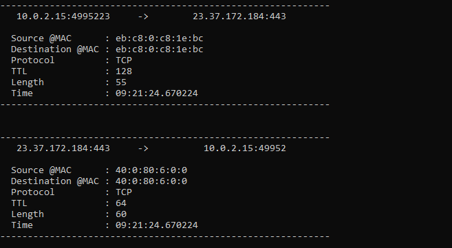

# 0xSniffer

Hello everyone! Just wanted to stop by and drop a project that I have been working on with a colleague.

It consist of a packet sniffer (with quite a non-imaginative name) and it is still in progress but it can already be used to make some packet analysis.

You can check this out at [my github repo](https://github.com/0xPxt/0xSniffer), or go to the “Projects” section of the blog and click on 0xSniffer.

I hope you have a great day, thanks for coming by! 🤩
