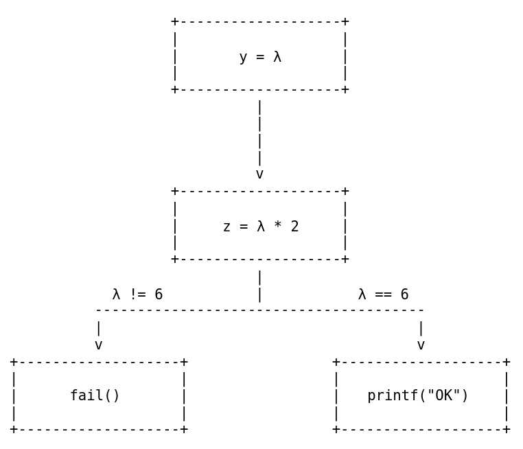

# Solving CTFs with angr

## Introduction

Welcome back everybody! 

I was trying my best through a Hack the Box reverse engineering challenge the other day and found myself pretty stuck looking at this :

```c
if ((((((((license[0x1d] == (char)((license[5] - license[3]) + 'F')) &&
               ((char)(license[2] + license[0x16]) == (char)(license[0xd] + '{'))) &&
              ((char)(license[0xc] + license[4]) == (char)(license[5] + '\x1c'))) &&
             ((((char)(license[0x19] * license[0x17]) == (char)(*license + license[0x11] + '\x17')
               && ((char)(license[0x1b] * license[1]) == (char)(license[5] + license[0x16] + -0x15))
               ) && (((char)(license[9] * license[0xd]) == (char)(license[0x1c] * license[3] + -9)
                     && ((license[9] == 'p' &&
                         ((char)(license[0x13] + license[0x15]) == (char)(license[6] + -0x80))))))))
             ) && (license[0x10] == (char)((license[0xf] - license[0xb]) + '0'))) &&
           (((((((char)(license[7] * license[0x1b]) == (char)(license[1] * license[0xd] + '-') &&
                (license[0xd] == (char)(license[0x12] + license[0xd] + -0x65))) &&
               ((char)(license[0x14] - license[8]) == (char)(license[9] + '|'))) &&
              ((license[0x1f] == (char)((license[8] - license[0x1f]) + -0x79) &&
               ((char)(license[0x14] * license[0x1f]) == (char)(license[0x14] + '\x04'))))) &&
             ((char)(license[0x18] - license[0x11]) == (char)(license[0x15] + license[8] + -0x17)))
            && ((((char)(license[7] + license[5]) == (char)(license[5] + license[0x1d] + ',') &&
                 ((char)(license[0xc] * license[10]) == (char)((license[1] - license[0xb]) + -0x24))
                 ) && ((((char)(license[0x1f] * *license) == (char)(license[0x1a] + -0x1b) &&
                        ((((char)(license[1] + license[0x14]) == (char)(license[10] + -0x7d) &&
                          (license[0x12] == (char)(license[0x1b] + license[0xe] + '\x02'))) &&
                         ((char)(license[0x1e] * license[0xb]) == (char)(license[0x15] + 'D'))))) &&
                       ((((char)(license[5] * license[0x13]) == (char)(license[1] + -0x2c) &&
                         ((char)(license[0xd] - license[0x1a]) == (char)(license[0x15] + -0x7f))) &&
                        (license[0x17] == (char)((license[0x1d] - *license) + 'X'))))))))))) &&
          (((license[0x13] == (char)(license[8] * license[0xd] + -0x17) &&
            ((char)(license[6] + license[0x16]) == (char)(license[3] + 'S'))) &&
           ((license[0xc] == (char)(license[0x1a] + license[7] + -0x72) &&
            (((license[0x10] == (char)((license[0x12] - license[5]) + '3') &&
              ((char)(license[0x1e] - license[8]) == (char)(license[0x1d] + -0x4d))) &&
             ((char)(license[0x14] - license[0xb]) == (char)(license[3] + -0x4c))))))))) &&
         (((char)(license[0x10] - license[7]) == (char)(license[0x11] + 'f') &&
          ((char)(license[1] + license[0x15]) == (char)(license[0xb] + license[0x12] + '+'))))) {
        puts("License Correct");
```

Good luck guessing what the correct license is, right? Well, it turns out there’s a software called angr that allows us to solve this challenges with almost no effort, and that is what I am going to dive into today.

## Introduction to Symbolic Execution

Keep in mind that any official explanation of the tool is hosted in [https://docs.angr.io/](https://docs.angr.io/), my only purpose is to make the learning curve a little less steep, thus my comments may be at some point inaccurate.

To understand what this tool does, we first need to be familiar with the concept of symbolic execution.

According to [Wikipedia](https://en.wikipedia.org/wiki/Symbolic_execution) :

> In [computer science](https://en.wikipedia.org/wiki/Computer_science), **symbolic execution** (also **symbolic evaluation** or **symbex**) is a means of [analyzing a program](https://en.wikipedia.org/wiki/Program_analysis) to determine what [inputs](https://en.wikipedia.org/wiki/Input_(computer_science)) cause each part of a program to [execute](https://en.wikipedia.org/wiki/Execution_(computing)).  An [interpreter](https://en.wikipedia.org/wiki/Interpreter_(computing)) follows the program, assuming symbolic values for inputs rather than obtaining actual inputs as normal execution of the program would.  It thus arrives at expressions in terms of those symbols for expressions and variables in the program, and constraints in terms of those symbols for the possible outcomes of each conditional branch. Finally, the possible inputs that trigger a branch can be determined by solving the constraints.
> 

If you didn’t fully understand the meaning, that’s fine. The core concept is that for any input that a program receives, symbolic execution consists of analyzing all of the paths that such input can traverse, and then **find which branches lead to the desired outputs**.

Let’s look at Wikipedia’s example and see what we can understand.

 Consider the following code:

```c
int f() {
  ...
  y = read();
  z = y * 2;
  if (z == 12) {
    fail();
  } else {
    printf("OK");
  }
}
```

If we ran a typical execution (also called “concrete execution”), `y` would be given a concrete value, then `z` would be assigned twice `y`'s value and finally a check would be performed.

For symbolic execution, though, `y` is assigned a symbolic value called lambda (`λ`), which means there is no concrete value assigned, it could be any number.

Since no value has been assigned, the concrete path can’t be taken and the check  `if (z == 12)` doesn’t have a concrete result. Therefore, two branches are created and there exist two paths that result in a different output.

Once all the paths have been calculated, [constraint solving](https://en.wikipedia.org/wiki/Constraint_programming) takes place, and lambda (`λ`) can be given values that comply with the checks it has gone through in every branch, hence providing concrete values for `y` for every possible path.

This means that once the analysis has finished, we get something like this :



Do you start to see how powerful this is? We can just “bypass” any check without the need to break our brains!

Now that we understand the core principle of angr, let’s use the tool.

## Hacking stuff with angr

Just as a reminder, remember to check [https://docs.angr.io/](https://docs.angr.io/) in case you have any doubt. The truth is that their documentation is awesome.

We are now going to solve the challenge that I showed you in the introduction. It must remain nameless because I don’t want the Hack The Box police to take down this write up, since I am covering a challenge that is still active and spoiling it is against the rules.

Let’s look at the code once again :

```c
if ((((((((license[0x1d] == (char)((license[5] - license[3]) + 'F')) &&
               ((char)(license[2] + license[0x16]) == (char)(license[0xd] + '{'))) &&
              ((char)(license[0xc] + license[4]) == (char)(license[5] + '\x1c'))) &&
             ((((char)(license[0x19] * license[0x17]) == (char)(*license + license[0x11] + '\x17')
               && ((char)(license[0x1b] * license[1]) == (char)(license[5] + license[0x16] + -0x15))
               ) && (((char)(license[9] * license[0xd]) == (char)(license[0x1c] * license[3] + -9)
                     && ((license[9] == 'p' &&
                         ((char)(license[0x13] + license[0x15]) == (char)(license[6] + -0x80))))))))
             ) && (license[0x10] == (char)((license[0xf] - license[0xb]) + '0'))) &&
           (((((((char)(license[7] * license[0x1b]) == (char)(license[1] * license[0xd] + '-') &&
                (license[0xd] == (char)(license[0x12] + license[0xd] + -0x65))) &&
               ((char)(license[0x14] - license[8]) == (char)(license[9] + '|'))) &&
              ((license[0x1f] == (char)((license[8] - license[0x1f]) + -0x79) &&
               ((char)(license[0x14] * license[0x1f]) == (char)(license[0x14] + '\x04'))))) &&
             ((char)(license[0x18] - license[0x11]) == (char)(license[0x15] + license[8] + -0x17)))
            && ((((char)(license[7] + license[5]) == (char)(license[5] + license[0x1d] + ',') &&
                 ((char)(license[0xc] * license[10]) == (char)((license[1] - license[0xb]) + -0x24))
                 ) && ((((char)(license[0x1f] * *license) == (char)(license[0x1a] + -0x1b) &&
                        ((((char)(license[1] + license[0x14]) == (char)(license[10] + -0x7d) &&
                          (license[0x12] == (char)(license[0x1b] + license[0xe] + '\x02'))) &&
                         ((char)(license[0x1e] * license[0xb]) == (char)(license[0x15] + 'D'))))) &&
                       ((((char)(license[5] * license[0x13]) == (char)(license[1] + -0x2c) &&
                         ((char)(license[0xd] - license[0x1a]) == (char)(license[0x15] + -0x7f))) &&
                        (license[0x17] == (char)((license[0x1d] - *license) + 'X'))))))))))) &&
          (((license[0x13] == (char)(license[8] * license[0xd] + -0x17) &&
            ((char)(license[6] + license[0x16]) == (char)(license[3] + 'S'))) &&
           ((license[0xc] == (char)(license[0x1a] + license[7] + -0x72) &&
            (((license[0x10] == (char)((license[0x12] - license[5]) + '3') &&
              ((char)(license[0x1e] - license[8]) == (char)(license[0x1d] + -0x4d))) &&
             ((char)(license[0x14] - license[0xb]) == (char)(license[3] + -0x4c))))))))) &&
         (((char)(license[0x10] - license[7]) == (char)(license[0x11] + 'f') &&
          ((char)(license[1] + license[0x15]) == (char)(license[0xb] + license[0x12] + '+'))))) {
        puts("License Correct");
```

What a monster…

Luckily, for symbolic execution to do what we want we will only need to **specify the point in the code that we want to reach**.

There are two options that we can choose from, and I will choose the lazy and easy one, which is telling angr to look for the string “License Correct”.

The other option is to give it the virtual address of the program that we want to know the path to, but I don’t want to disclose too much information about the challenge, so I’ll stick to looking for the string (which to be honest is as useful as the other option in this particular case).

To install angr you need to create a python virtual environment, which you can do with :

`python -m venv angr`

Then, you can activate the virtual environment with :

`source angr/bin/activate`

According to the [python docs](https://docs.python.org/3/library/venv.html) :

> The `venv` module supports creating lightweight “virtual environments”, each with their own independent set of Python packages installed in their `[site](https://docs.python.org/3/library/site.html#module-site)` directories. A virtual environment is created on top of an existing Python installation, known as the virtual environment’s “base” Python, and may optionally be isolated from the packages in the base environment, so only those explicitly installed in the virtual environment are available.
> 

**Trust me and don’t skip this step because angr will not work without a virtual environment.**

A friend told me…

Once inside the virtual environment (just get in with `cd`), angr can be installed :

`python -m pip install angr` 

And now we can start playing!

To use angr we can either create a python script or directly run python commands from the Python Shell.

First of all, we need to import `claripy` and `angr` :


Then we create an angr project with `angr.Project()` :


(I am blurring the path because it contains the name of the challenge)

Now it is time to define the arguments that the program receives. 

Through some reversing work, I found out that this challenge expects a license of size 0x20, so we tell angr the argument size and we create a bitvector ([read here to learn about those](https://docs.angr.io/en/latest/core-concepts/solver.html)) with 8 bits for each character :


With this instructions, we now have our arguments in the form `./program <license 8*0x20>`.

If you are just too lazy to read about bitvectors, at least I need to tell you that these are the lambda symbols (`λ`) that we used in our previous example.

The next step is to let angr know the entry state, which can be understood as the first state in the execution. Once that is done, we can create the simulation manager, and tell it to take off from the entry state :


And finally, we can run the simulation with the `explore()` method, and telling it what to find :


If everything went as expected, we get our flag :


## Conclusion

As you have seen, angr is an incredibly powerful tool, and this demonstration is just a tiny part of all it can do.

I am going to be honest here, I recently discovered the tool and I am just learning how to use it, and that is why I brought this post. If there is anything that you think I could have explained better or you have any doubt, please do not hesitate to contact me.

Nevertheless, even with the little knowledge that I have, it is doubtless that I will use angr a lot more, at least in CTFs and reversing challenges because of how easy it is to use and how much it accomplishes.

Now I just need to get better at using it, and you too!

I hope this post has helped you understand this tool and its power, or at least drawn a smile in your face. 

Have a great day!

<style>
    img:not(.logo_img) {
        box-shadow: 0px 0px 10px gray;
        border-radius: 5px;
    }
</style>
