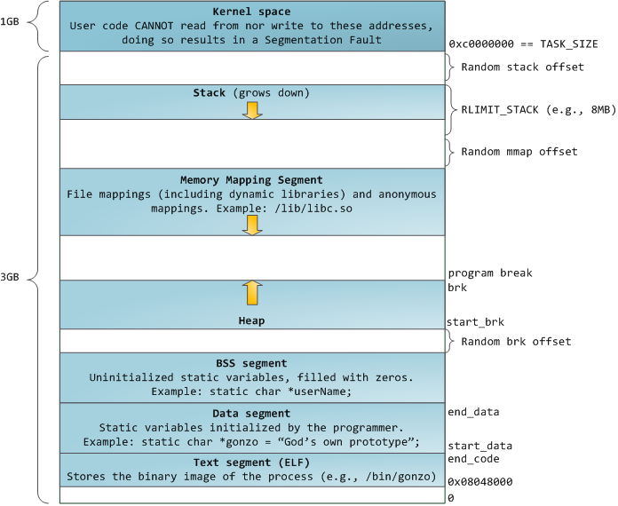

# Doug Lea’s malloc (Linux Heap)

## Introduction

It is no surprise that many software is flawed when regarding to security. And it also does not take aback anyone to say that many of the security issues that occur in modern software are the result of memory corruption vulnerabilities.

Today we will have a look at the implementation of malloc first proposed by Doug Lea in 1987. 

Of course, this implementation is nowadays deprecated, however, it helps us understand where today’s implementations come from, as well as providing a softer path to exploitation.

## What is malloc?

> **C dynamic memory allocation** refers to performing manual memory management for dynamic memory allocation in the C programming language via a group of functions in the C standard library, namely malloc, realloc, calloc, aligned_alloc and free. - [Wikipedia](https://en.wikipedia.org/wiki/C_dynamic_memory_allocation)
> 

Now that we have read the formal definition, let’s try to make things a little simpler.

Dynamic memory allocation consists of **allocating memory in runtime**, which means that memory is allocated as the program is being executed.

`malloc` allows the programmer to request to the memory allocator a pointer to a chunk of memory, which the programmer will use later on for god knows what.

A classic example for using `malloc` is when we want to create an array and we can’t know its size at compile time.

Let’s imagine we have a function and the size of the array is passed as a parameter :

 

```c
void func(unsigned short size) {
    char arr[size]; //Wrong!!

    for (unsigned short i = 0; i < size; i++) {
        arr[i] = 0xFF;
    }

    return;
}
```

This function will not compile.

Why? Because the compiler can’t know the value of `size` without running the program, and that is when `malloc` comes into play :

```c
void func(unsigned short size) {
    char *arr;

    arr = (char*)malloc(size);

    for (unsigned short i = 0; i < size; i++) {
        arr[i] = 0xFF;
    }

    // Remember to free() or the memory police comes.
    free(arr);

    return;
}
```

This last code snippet will not have any trouble compiling, and memory will be allocated for the array when `malloc` is called.

## How does malloc work?

Now we have come to the beefy part. From now on, we will learn and discuss the implementation of `malloc` (by Doug Lea).

I am obviously doing this because there are some posts about heap exploitation coming, and we need to understand how the heap works in order to hack it.

Let’s throw out some definitions first, and afterwards it will be clear why we need them :

 * Heap --> The heap is a large area of memory available for use by the program.
The program can request areas, or “blocks”, of memory for its use
within the heap. In order to allocate a block of some size, the program makes an
explicit request by calling the heap allocation operation.
 * Chunk --> A small range of memory that can be allocated, freed, or combined with adjacent chunks into larger ranges.
Chunks of memory carry around with them size information fields both before and after the chunk, typically referred to as meta-data.
 * Bin --> Available chunks are maintained in bins, grouped by size. In other words, a bin is a collection of free chunks.

Only by reading this definitions, you can start to imagine how the memory allocator will work.

The algorithm follows the following steps :

1. If the programmer requests a chunk of memory, and there is a chunk big enough to fulfill such request, that is the chunk that will be used.
2. If the first step can’t be executed, then `malloc` will create a new chunk from the top chunk.
3. Otherwise, the implementation will make use of a syscall to aggregate new memory to the end of the heap. It is from this new memory, that the allocator will create a new chunk.
4. If everything has failed, `malloc` returns `NULL`.

I believe there are a couple of questions that need to be answered here.

First off let’s answer the easy one, what on Earth is the top chunk?

Good question! The top chunk, also called *the wilderness* (cool, huh?) is the topmost chunk of the heap, and it borders the address allocated from the operating system.

Let’s read Doug Lea’s definition!

> The “wilderness'' (so named by Kiem-Phong Vo) chunk represents the space bordering the topmost address allocated from the system. Because it is at the border, it is the only chunk that can be arbitrarily extended (via `sbrk` in Unix) to be bigger than it is (unless of course `sbrk` fails because all memory has been exhausted).
> 

It is important to highlight that the top chunk is that it is **the only chunk that can be extended via system calls**.

And how not, this leads us to the second question, how do the syscalls that expand the heap work?

That’s an even better question! But it also requires a little bit of a deeper explanation, let’s see…

The definitions for `brk` and `sbrk` given by the manpages are the following :

```
brk() and sbrk() change the location of the program break, which
    defines the end of the process's data segment (i.e., the program
    break is the first location after the end of the uninitialized
    data segment).  Increasing the program break has the effect of
    allocating memory to the process; decreasing the break
    deallocates memory.

brk() sets the end of the data segment to the value specified by
    addr, when that value is reasonable, the system has enough
    memory, and the process does not exceed its maximum data size
    (see setrlimit(2)).

sbrk() increments the program's data space by increment bytes.
    Calling sbrk() with an increment of 0 can be used to find the
    current location of the program break.
```

Long story short, resizing the heap is as easy as telling the kernel to adjust the program break.

And the program break can be understood as the address where a process’ heap segment ends.

Let me steal a picture from Google that will help you :



As a fun fact, let me explain that when the program break is changed, the process can access the addresses in the newly allocated area, but no physical memory pages are allocated yet. The kernel automatically allocates new physical pages when the process tries to access the aforementioned addresses.

Just in case the definitions of `brk` and `sbrk` are still blurry to you, lets try to shed some light by rewording the documentation.

The `brk` system call moves the program break, and it moves it to the address specified in its first and only argument.

This is `brk`'s signature :

```c
int brk(void *addr);
```

On the other hand, `sbrk` is a little trickier, but do not worry, it is still very easy to understand.

`sbrk`’s signature is as follows :

```c
void *sbrk(intptr_t increment);
```

And all this does is also move the program break, but instead of passing an address as a parameter, the call needs an increment, which will be added to the current program break.

This means that, if the program break is at `0x4000FFF0` and `sbrk(0x0A);`is called, the program break will be moved to `0x4000FFFA`.

### Some sidenotes about `brk` and `sbrk`

There needs to be a certain degree of care when using these syscalls.

1. Trying to set the program break to a value lower than its initial value will result in undefined behavior (Please read [this hilarious article](https://raphlinus.github.io/programming/rust/2018/08/17/undefined-behavior.html)).
2. The upper limit on where the program break can be set depends on different factors, such as shared memory segments, shared libraries or the process’ resource limit for the size of the data segment.
3. Virtual memory is allocated with a granularity of a page, thus addresses passed as arguments are effectively rounded up to the next page boundary.

## Overview of a basic Heap Overflow

It’s not in the scope of this post to do a PoC of a heap overflow, but I don’t want to leave without presenting the following question :

What happens if there are some protections missing and we can **overflow a buffer in the heap?** **What if this overflow overwrote the meta-data of a chunk?** Yes, some very bad things can be accomplished by answering this two questions maliciously, but we will see that in depth another day!

## Conclusion

This post has helped us understand how an old memory allocator works, and let me tell you, new allocators are not very different from this one (there is multi-threading and some more magic, but the basics stay the same).

It is important to understand that heap exploitation relies on exploiting the implementation of these kind of memory allocators, thus it is a requisite to understand how they work in order to break them.

I will leave down below some very valuable resources, as well as the source code for Doug Lea’s `malloc`, so that you can be a good nerd and dive into the code to figure out the details.

I know I always say the same, but it really makes me happy to know that you are reading this and I wish you to have a lovely day!

### Resources

[A Memory Allocator, Doug Lea](https://gee.cs.oswego.edu/dl/html/malloc.html)

[System Calls Manual, brk(2)](https://man7.org/linux/man-pages/man2/brk.2.html)

[ARM Heap Exploitation, pt1](https://azeria-labs.com/heap-exploitation-part-1-understanding-the-glibc-heap-implementation/)

[The Shellcoder’s Handbook : Discovering and Exploiting Security Holes](https://www.wiley.com/en-dk/The+Shellcoder%27s+Handbook%3A+Discovering+and+Exploiting+Security+Holes%2C+2nd+Edition-p-9780470080238)

[The Linux Programming Interface](https://nostarch.com/tlpi/)

<style>
    img:not(.logo_img) {
        box-shadow: 0px 0px 10px gray;
        border-radius: 5px;
    }
</style>
