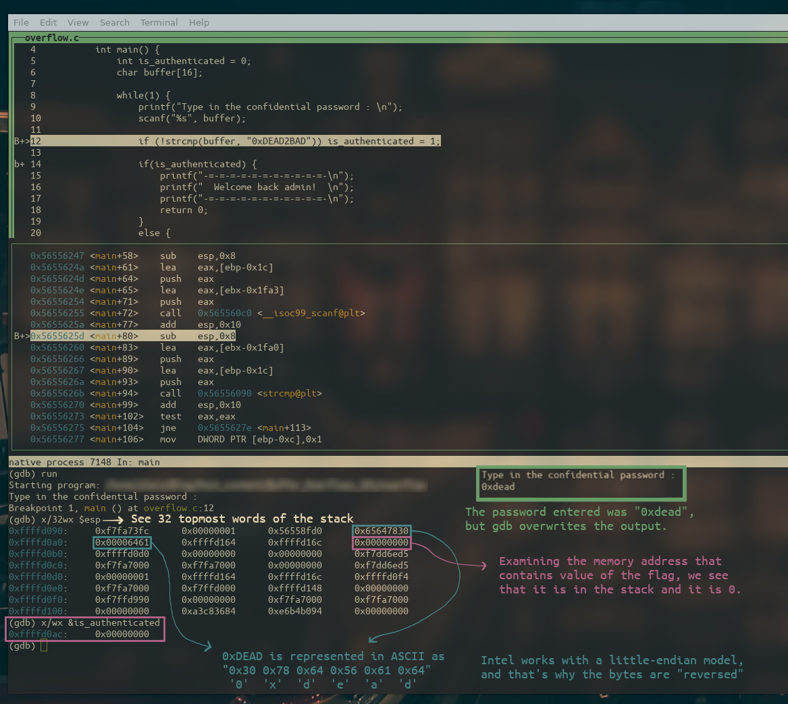

# Buffer Overflow Basics

## Introduction

Have you ever heard of the term “buffer overflow”? I am sure you have, but do you really understand what goes on in the computer when such thing happens?

In the following example, an executable asks for a secret password, and it does not seem to be very happy when the input is incorrect…


We’ll see the code later, but it is pretty clear that the password is `“0xDEAD2BAD”`.

But what if I showed you that there is a way of bypassing this security measure without knowing the password? 


What did just happen? Well, if that is your reaction, I’m glad to tell you that you have come to the right place.

In this article, I will try to clarify, with the behavior of the simplest buffer overflow possible (the one right above), what this technique consists of, how to carry it out and how to mitigate its effects.

## The Stack

To properly understand any kind of buffer overflow, it is an obligation to know what the stack is and how it works (though for now we only need roughly a high level knowledge of its internals).

The stack is a region of memory that any program dedicates to the allocation of different items. Some of these items are local variables, return addresses, register values, and more. As you will see, the stack has a fixed origin and is variable in size.

The stack is a **LIFO (Last In First Out)** data structure, which means that each item can only be removed from the stack if every item that has been put into it afterwards has also been removed.

The analogy that I find more appealing to understand the concept of the stack is a pile of plates.

When you have a bunch of plates stacked (← see what I did there?) one on top of the other, you can only take the one that is on the top, or else you will have to spend money on new plates.

There are two keywords that I would like to introduce :

- Push
- Pop

You shouldn’t sweat much to understand these two. Pushing an item means putting it on top of the stack, and popping means removing the topmost item.

The last piece of knowledge required regarding the example that I am presenting is that the stack is where a program stores the local variables.

Given the following function `foo()` :

```c
void foo() {
		int var1 = 0;
		int var2 = 0;
		char god[10];
		strcpy(god, "0xPxt");
}
```

The stack frame for `foo()` would look something like this :


(A stack frame is pushed to the stack for each function, but don’t worry too much about this).

This is by no means all of what the stack frame for `foo()` would contain, but for our today’s purpose, this suffices.

Do you see that there is an arrow pointing to the top of the stack? Well, the computer will take care of this for us and will store that position in a register called “Stack Pointer”.

This register is named `sp`, but you will find that it is often prefixed with a letter. That letter indicates the amount of bytes that we want to access, but again, don’t worry too much about these details and just remember that `<some letter> + sp → Stack Pointer`.

## Buffer Overflow

I can’t describe the concept better than Wikipedia, so here you have their definition :

> A **buffer overflow,** or **buffer overrun** is an anomaly whereby a program while writing data to a buffer overruns the buffer's boundary and overwrites adjacent memory locations.
> 

To exemplify this, let’s take the stack frame from the previous `foo()` function and see its behavior more in detail when we use different character arrays for the `god` buffer.

If we write something that is in bounds, the stack would look something like the following :

```c
void foo() {
		int var1 = 0;
		int var2 = 0;
		char god[10];
		strcpy(god, "0xDEAD");
}
```


However, if we write something that goes past the boundaries of the buffer, our string would overwrite the adjoining memory regions.

```c
void foo() {
		int var1 = 0;
	  int var2 = 0;
		char god[10];
	  strcpy(god, "Some Other Guy");
}
```


Woah! As I just explained, looks like some stuff that wasn’t supposed to change was overwritten by `strcpy()`. And this is exactly what a buffer overflow is. There are some functions that do not check the length of what is being written against what it is being written to, and this is the disastrous result.

### Overflow.c

Armed with this wisdom, let’s take a more profound look at the program that I showed you during the Introduction.

```c
#include <stdio.h>
#include <string.h>

int main() {
    int is_authenticated = 0; //Flag to allow access
    char buffer[16];          //Buffer for user input

    while(1) {
        //Read password from user
        printf("Type in the confidential password : \n");
        scanf("%s", buffer); //<---- Vulnerable here!!

        //Compare the input to the correct password and update the flag
        if (!strcmp(buffer, "0xDEAD2BAD")) is_authenticated = 1;

        if(is_authenticated) {
            //User input OK
            printf("-=-=-=-=-=-=-=-=-=-=-=-\n");
            printf("  Welcome back admin!  \n");
            printf("-=-=-=-=-=-=-=-=-=-=-=-\n");
            return 0;
        }
        else {
            //User input WRONG
            printf("-=-=-=-=-=-=-=-=-=-=-=-\n");
            printf("       (ಠ_ಠ)┌∩┐\n");
            printf("-=-=-=-=-=-=-=-=-=-=-=-\n");
        }
    }
}
```

As the comment points out, there is a `scanf()` which will write to the `buffer` that is later used to check against the password. What happens is that by overflowing the `buffer` we overwrite the `is_authenticated` flag, and since the program is only checking for it to be different than 0, we are granted access.

<aside>
❔ Side note : If the program expected the flag to be exactly 1, we could modify our input to overwrite the flag with exactly that value, but it was not necessary this time.

</aside>

Future examples will be more fun and complicated than this one, but it is essential to understand the basics in order to learn progressively without shooting ourselves in the foot.

### GDB

Thanks to GDB (GNU debugger) we can carry out a thorough analysis of what happens in memory, which will lead us to fully understanding the buffer overflow.

It is important to highlight that I have compiled the program with the following line :

`gcc -fno-stack-protector overflow.c -o overflow -g -m32` 

Which means that the binary will have no stack protection (if it was activated, our buffer overflow wouldn’t work) and it will be compiled for a 32-bit architecture.

GDB is executed with `gdb -q ./overflow`. The `-q` option is just to skip the GDB headers when launching it.

Let’s now see the source code of the program with `list` and add some breakpoints with `break` :


Once the breakpoints are set, I will execute a couple of GDB commands in order to ease the steps that are to come :

- `set disassembly-flavor intel` →Changes the assembly syntax from AT&T to Intel (this is just personal preference).
- `layout split` →Provides us with a beautiful layout to see the source code and the assembly throughout the debugging session.

It’s time to run the program, as you can see in the image below, the program breaks (at the first breakpoint) after having specified a password, which in this case was “0xdead”.

By examining the stack and the `is_authenticated` flag, we see that everything seems to be in order.

<aside>
❔ `x/32wx $esp` displays the 32 words that are after the stack pointer.
`x/wx &is_authenticaded` displays the value of the flag and its address.

</aside>



The following breakpoint is a clutch one, since the program stops when the flag is about to be checked, and we can see that its value is 0.


We have observed that with a short (and incorrect) password the flag doesn’t change,  let’s try to overflow the buffer by giving it the string `AAAABBBBCCCCDDDDEEEEFFFFGGGGHHHH`.

Notice that I intentionally use different characters in the string so that I can see which character is placed in each memory location when I examine the stack.

By examining the stack and the flag, it appears that the value of the stack has been overwritten with the number `0x45454545`, which is the hex value for ASCII `EEEE`, this means that if we wanted, it would be possible for us to overwrite the flag with any value we desired just by substituting `EEEE` with our choice.


We know the flag has been overwritten by now, but just to be sure let’s keep executing our program and see what happens…

The next figure illustrates the assembly line that compares the flag with `0`, and we know our flag is `0x45454545` , so we should bypass this check. 


That’s right, the comparison went as expected and the `je` (jump if equal) instruction didn’t jump.


And finally, we hit the part of the code which makes us gain access to the admin panel!


## Conclusion

This article is coming to its end, but before finishing it, I want to clarify that the likelihood of finding this kind of buffer overflow is really low, since compilers now take care of adding protections with the aim of preventing this type of flaws. However, I still think it is really interesting to understand the basic principles on which buffer overflows stand. If you grab any old machine and try to exploit a binary this way, you’ll most likely succeed, but it is unrealistic to think that this can happen in a machine of today.

(Changing directions completely for a second) Can you imagine a way of preventing this type of overflow happening without relying on the compiler? What if we changed the declaration of the `is_authenticated` flag and we declare it right after the buffer, instead of before? Yep, your’re right, the buffer now can’t overflow the flag because its growth direction doesn’t collision with it. 

There are still other types of exploits that could bypass this slight modification, but I feel like its an elegant solution to a concrete problem and wanted to show it to you.

Hopefully you have had some fun by reading this post (and learnt something!), I want you to know that I feel very thankful if you have reached this far in the article, and you can expect many more to come.

### References

- Hacking: The Art of Exploitation, 2nd Edition, Jon Erickson.
- [Buffer Overflow - Wikipedia](https://en.wikipedia.org/wiki/Buffer_overflow)
